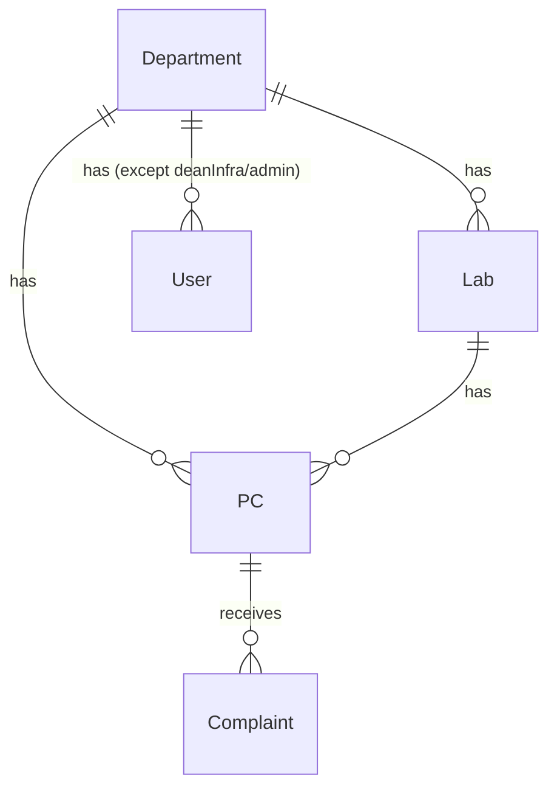
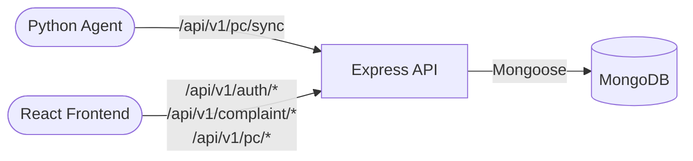
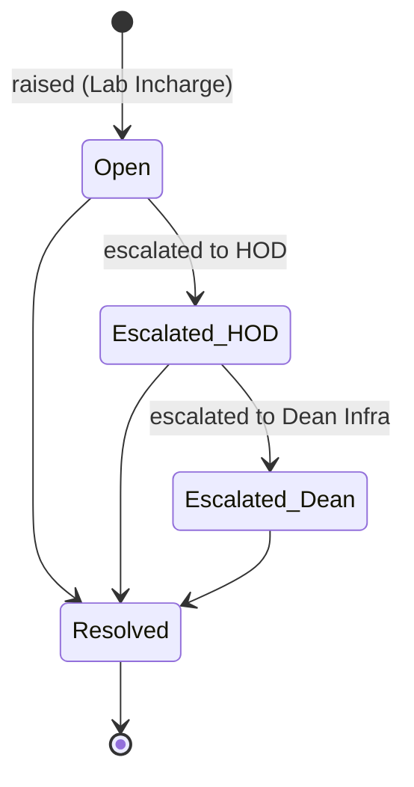
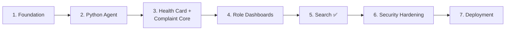

# LABMON

LABMON is a MERN-based lab PC health monitoring and complaint management system for college environments. A lightweight Python agent collects each lab PC's hardware and software configuration, syncs it to the backend, and keeps a digital health card updated with department, lab, dead stock number, and warranty status.

The system also supports public complaint submission without login. Each complaint is tracked with a unique token and moves through a strict escalation flow: Lab Incharge -> HOD -> Dean Infra. Role access is scoped by department, and Lab Incharge/HOD/Dean Infra users can search PCs by dead stock number, hardware, installed software, or warranty status to locate machines quickly across labs.

## Goals

- Track lab PC health and configuration centrally.
- Allow public complaint submission with token-based tracking.
- Enforce department and role-based access control.
- Support PC discovery by hardware and installed software.
- Keep the platform lightweight enough to be deployed within 1-2 months.

## Tech Stack

- Backend: Node.js + Express
- Database: MongoDB + Mongoose
- Frontend: React.js
- Agent: Python system configuration collector
- Authentication: JWT

## Repository Status

This repository now spans all three planned runtimes — backend, Python agent, and a
partially-built React frontend — not just the backend scaffold.

- Completed: Department, Lab, User, PC, and Complaint models; JWT auth (register with
  OTP email verification, plain-password login, refresh-token rotation, logout, resend-
  OTP, session rehydration via `GET /me`); role and department scoping middleware; PC
  sync (including first-time provisioning with department/lab), health-card, search, and
  public lookup endpoints; complaint raise/escalate/resolve/track/list endpoints;
  department listing; a functional (unpackaged) Python agent; a React frontend with
  working auth screens, PC search, raise/track-complaint flows, and one fully-built
  dashboard (Lab Incharge).
- Next planned work: Admin CRUD for Department/Lab/User/PC, role-dashboard
  aggregation/summary endpoints, agent device-key auth, rate limiting, Dockerization/CI.
  See [`backend/docs/`](./docs/README.md) for the detailed, code-verified current state.

## Data Model

### Department

```text
name  String, required, unique
code  String, required, unique, uppercase
```

### Lab

```text
name        String, required
department  ObjectId -> Department, required
incharge    ObjectId -> User
```

### User

```text
name        String, required
email       String, required, unique, lowercase
password    String, required (bcrypt hashed)
role        Enum: labIncharge | hod | deanInfra | admin
department  ObjectId -> Department (null for admin/deanInfra)
```

### PC

```text
deadStockNo   String, required, unique
department    ObjectId -> Department, required
lab           ObjectId -> Lab, required
warranty      { status: Enum(active/expired), expiryDate: Date }
purchaseDate  Date
config        {
	cpu, ram, disk, os,
	software: [String],
	lastSyncedAt: Date
}
```

Indexed on `{ department: 1, lab: 1 }` and `{ "warranty.status": 1 }`, in addition to
the implicit unique index on `deadStockNo`.

### Complaint

```text
token         String, required, unique
pc            ObjectId -> PC, required
department    ObjectId -> Department, required
lab           ObjectId -> Lab, required
description   String, required
raisedBy      { name, contact }
status        Enum: Open | Escalated_HOD | Escalated_Dean | Resolved
currentLevel  Enum: labIncharge | hod | deanInfra
history       [{ level, action, by: ObjectId -> User, at: Date }]
```

## Relationships



## Planned Architecture



## API Surface

### Auth (`/api/v1/auth`) — implemented

- `POST /register` - Public today (roadmap: should become Admin only)
- `POST /verify-email` - Public
- `POST /resend-otp` - Public
- `POST /login` - Public (password check, issues JWT cookies directly — no login-OTP step)
- `POST /refresh-token` - Public (authenticates via the `refreshToken` cookie)
- `POST /logout` - Auth required
- `GET /me` - Auth required

### Department (`/api/v1/dept`) — implemented (read-only)

- `GET /` - Public, lightweight `{name, code}` list

### Department / Lab / User / PC admin CRUD — not yet implemented

- `POST/PUT/DELETE /api/v1/dept/:id`, and equivalent Lab/User/PC admin CRUD routes -
  planned, Admin only, none exist yet (only the read above and PC's own endpoints exist).

### PC (`/api/v1/pc`) — implemented

- `POST /sync` - No auth yet (roadmap: Agent device key). Upserts a PC's `config` by
  `deadStockNo`; if the PC doesn't exist yet and `department`+`lab` are supplied,
  provisions a new PC record instead of 404ing.
- `GET /lookup/:deadStockNo` - Public. Confirms a dead stock number is real and returns
  its department/lab, used by the public raise-complaint form.
- `POST /:id/health-card` - Auth + `deptScope` (department-scoped; implemented as `POST`
  though it's a pure read).
- `GET /search?deadStockNo=&cpu=&ram=&disk=&os=&software=&warrantyStatus=&lab=` - Lab
  Incharge, HOD, Dean Infra (department-scoped for Lab Incharge/HOD; unrestricted for
  Dean Infra).

### Complaints (`/api/v1/complaint`) — implemented

- `POST /` - Public
- `GET /track/:token` - Public
- `GET /` - Auth required; role- and escalation-level-scoped list (not filtering/paging
  yet)
- `PATCH /:id/escalate` - Lab Incharge, HOD
- `PATCH /:id/resolve` - Lab Incharge, HOD, Dean Infra

## Response Codes

### HTTP

- `200` OK - Successful GET/PUT
- `201` Created - Successful POST
- `400` Bad Request - Validation failure
- `401` Unauthorized - Missing or invalid JWT
- `403` Forbidden - Role or department scope violation
- `404` Not Found - Resource does not exist
- `409` Conflict - Duplicate unique field
- `500` Internal Server Error - Unhandled exception

### Complaint Status



- `Open` - Newly raised, with Lab Incharge
- `Escalated_HOD` - Escalated to HOD
- `Escalated_Dean` - Escalated to Dean Infra
- `Resolved` - Closed

## Roadmap



### Phase 1: Foundation

- MVC skeleton
- All 5 Mongoose models
- JWT auth
- Role and department scoping middleware

### Phase 2: Python Agent

- Hardware/software collector
- Sync endpoint integration

### Phase 3: Health Card + Complaint Core

- Health card view
- Public complaint flow and token system
- Escalation state machine

### Phase 4: Role Dashboards

- Lab Incharge, HOD, and Dean Infra dashboards
- Backend-enforced visibility

### Phase 5: Search (Done)

- PC search by dead stock number, hardware config, installed software, and warranty status
- Regex-escaped, case-insensitive partial matching; department-scoped for Lab Incharge/HOD, unrestricted for Dean Infra
- Indexed queries (`department`+`lab`, `warranty.status`)

### Phase 6: Security Hardening

- Rate limiting
- Validation
- Audit logs
- CORS and Helmet

### Phase 7: Deployment

- Dockerization
- CI/CD
- MongoDB Atlas
- Agent packaging
- Load testing

## Local Setup

1. Install dependencies.
2. Create a `.env` file with the required values.
3. Start MongoDB locally or point `MONGO_URL` to Atlas.
4. Run the server.

### Environment Variables

```text
PORT=5000
MONGO_URL=mongodb://127.0.0.1:27017/labmon
CORS_ORIGIN=http://localhost:3000
```

### Scripts

- `npm start` - Start the server
- `npm run dev` - Start the server with nodemon

## Current Backend Entry Points

- `server.js` loads environment variables, connects to MongoDB, and starts the Express app.
- `src/app.js` defines the Express instance and middleware setup.
- `src/config/db.config.js` handles MongoDB connectivity.

## Notes

- Complaint tokens should remain unique and easy to share for public tracking.
- Department scope must be enforced on all role-protected endpoints.
- The Python agent should only sync machine inventory data needed for the health card.
