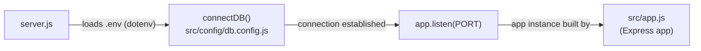
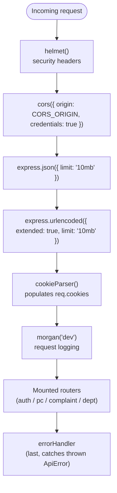
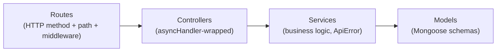
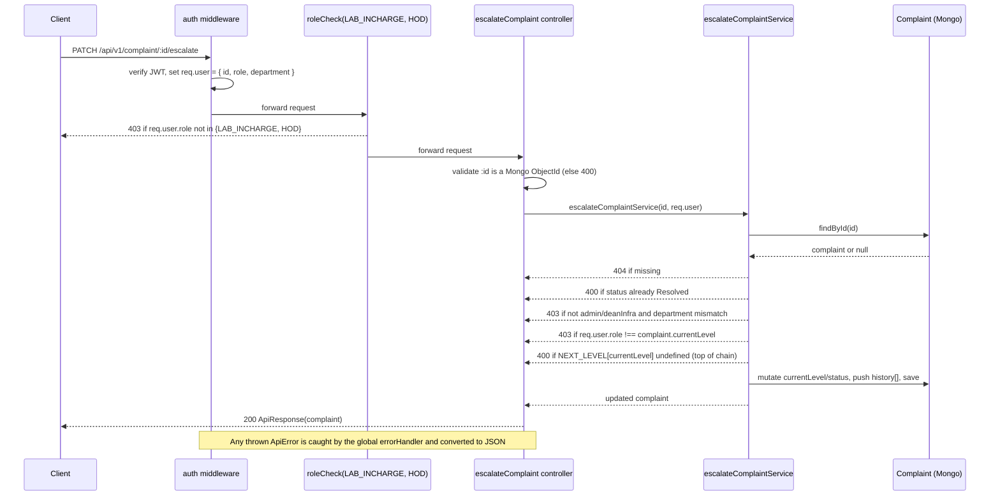

# Architecture

## Entry point chain



`src/app.js` builds and exports the Express instance. It does not call `listen` itself —
that's `server.js`'s job — which keeps the app importable/testable without binding a
port (used by `src/tests/*.test.js`).

## Middleware stack (global, in `app.js`)

Applied in this order, to every request:



1. `helmet()` — sets security-related HTTP headers.
2. `cors({ origin: CORS_ORIGIN, credentials: true })` — allows the configured frontend
   origin, with cookies allowed cross-origin.
3. `express.json({ limit: "10mb" })` — parses JSON bodies.
4. `express.urlencoded({ extended: true, limit: "10mb" })` — parses form bodies.
5. `cookieParser()` — populates `req.cookies` (used for reading the `accessToken`/
   `refreshToken` cookies set at login).
6. `morgan("dev")` — request logging.

Then routers are mounted, then `errorHandler` last (see [`middlewares.md`](./middlewares.md)).

## Router mounts

```js
app.use("/api/v1/auth", authRouter);
app.use("/api/v1/pc", pcRouter);
app.use("/api/v1/complaint", complaintRouter);
app.use("/api/v1/dept", deptRouter);
```

## Layering convention



- **Routes** (`src/routes/`) wire an HTTP method + path to a controller function, and
  attach any per-route middleware (`auth`, `deptScope`, `roleCheck`, and — on public or
  otherwise sensitive routes — a rate limiter from `src/middlewares/rateLimiter.js` and a
  Zod `validate(schema)` from `src/middlewares/validate.middleware.js`, with schemas
  defined in `src/validators/`; see [`middlewares.md`](./middlewares.md)).
- **Controllers** (`src/controllers/`) are thin. Each handler is wrapped in
  `asyncHandler` (see [`utils.md`](./utils.md)) so a thrown/rejected error is forwarded
  to Express's error-handling middleware instead of needing a `try/catch` in every
  handler. A controller's job is: pull data out of `req`, call one service function,
  shape an `ApiResponse`.
- **Services** (`src/services/`) hold all business logic — validation beyond schema
  constraints, cross-model lookups, state-machine transitions (e.g. complaint
  escalation), token/OTP issuance. Services throw `ApiError` for anything that should
  become an HTTP error response.
- **Models** (`src/models/`) are Mongoose schemas. Schema-level `required`/`enum`/
  `unique`/custom `validate` are the first line of defense; anything more complex than
  that lives in the service layer.

This means a controller never talks to a model directly, and a route never contains
business logic — both of those only happen in `src/services/`.

## Request lifecycle example: escalating a complaint



Every layer that can fail throws `ApiError(statusCode, message)`; nothing writes to
`res` directly except the final controller step and `errorHandler`.
