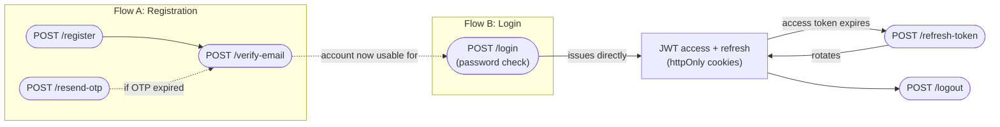
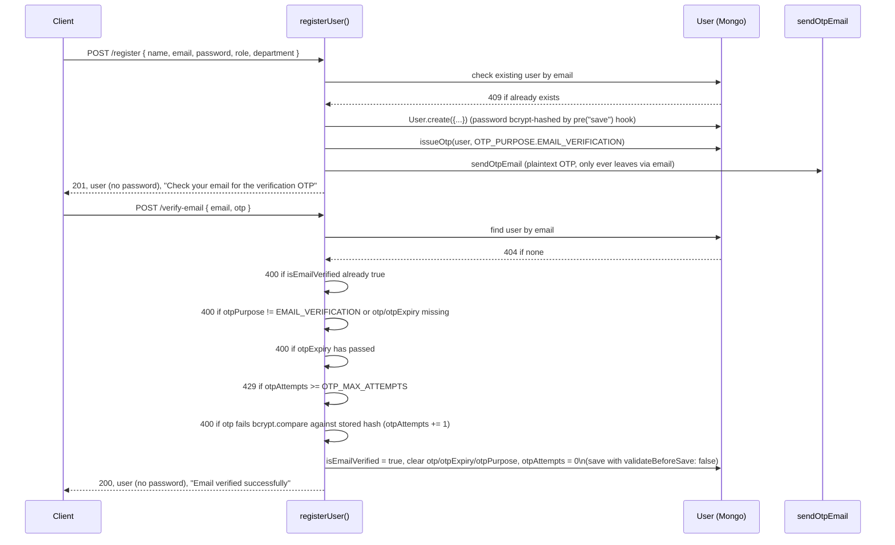

# Auth Module (Phase 1 / Phase 3 groundwork) — detailed

Files involved:

- `src/routes/auth.route.js`
- `src/controllers/auth.controller.js`
- `src/services/auth.service.js`
- `src/models/user.model.js`
- `src/middlewares/auth.middleware.js` (consumes the tokens this module issues)
- `src/utils/tokenGeneration.js`
- `src/utils/otp.js`
- `src/utils/mailer.js`
- `src/config/constants.js` (`OTP_PURPOSE`, `OTP_EXPIRY_MINUTES`)

Registration is a **two-step, OTP-gated flow** (an OTP sent to the user's email must be
verified before the account is usable). Login, by contrast, is a **plain password
check that issues tokens directly** — the login-OTP step (`POST /verify-login-otp`) that
used to sit between password check and token issuance has been removed from the code.

## Routes (`src/routes/auth.route.js`)

```js
router.post("/register", register)
router.post("/verify-email", otpVerifyLimiter, validate(verifyEmailSchema), verifyEmail)
router.post("/resend-otp", otpResendLimiter, validate(resendOtpSchema), resend)
router.post("/login", loginLimiter, validate(loginSchema), login)
router.post("/refresh-token", refresh)
router.post("/logout", auth, logout)
router.get("/me", auth, me)
```

All but `logout` and `me` are public (no `auth` middleware) — that's correct for
`register`/`verify-email`/`resend-otp`/`login`/`refresh-token`, since they're the
pre-authentication flow itself; `refresh-token` authenticates via the `refreshToken`
cookie instead of a Bearer access token. Mounted at `/api/v1/auth` in `app.js`, so the
live paths are `/api/v1/auth/register`, `/api/v1/auth/verify-email`,
`/api/v1/auth/resend-otp`, `/api/v1/auth/login`, `/api/v1/auth/refresh-token`,
`/api/v1/auth/logout`, `/api/v1/auth/me`.

`verify-email`, `resend-otp`, and `login` — the three publicly-reachable,
guessing/spam-sensitive routes — now go through a rate limiter and a Zod `validate`
schema before their controller (see [`middlewares.md`](./middlewares.md)). `register`
was deliberately left untouched by this pass — see
[`known-issues.md`](./known-issues.md). `refresh-token` isn't rate-limited since it
requires possession of a valid `refreshToken` cookie, which is a much narrower attack
surface than a bare email/password guess.

## Registration's OTP flow, and login's lack of one

The `User` model has a shared set of OTP fields (`otp`, `otpExpiry`, `otpPurpose`),
disambiguated by `OTP_PURPOSE` from `constants.js`. Since login no longer issues an
OTP, `OTP_PURPOSE.EMAIL_VERIFICATION` is currently the only purpose in the enum — kept
as a lookup table rather than a single hardcoded string so a future OTP-gated flow
(e.g. password reset) can add a purpose without touching every call site that reads
`user.otpPurpose`.



### Flow A: Registration + email verification



Note: `registerUser` does not enforce that `role`/`department` are consistent (e.g.
that only an admin can create another admin, or that a non-admin role has a
non-null `department`). There's no `auth`/`roleCheck` on `/register` at all — anyone
can self-register as any role. This is flagged in
[`known-issues.md`](./known-issues.md); `backend/Readme.md`'s planned API surface says
registration should be "Admin only."

### Flow B: Login (password check issues tokens directly)

```mermaid
sequenceDiagram
    participant Client
    participant API as loginUser()
    participant DB as User (Mongo)

    Client->>API: POST /login { email, password }
    API->>DB: find user by email
    DB-->>API: 401 "Invalid email or password" if not found
    API->>API: 401 same message if comparePassword() fails
    API->>API: 403 "Please verify your email before logging in" if !isEmailVerified
    API->>API: generateAccessToken(user), generateRefreshToken(user)
    API->>DB: refreshToken = hash(refreshToken); save
    API-->>Client: 200 { user } + httpOnly accessToken/refreshToken cookies
```

`loginUser` validates credentials (deliberately the same 401 message for "no such user"
and "wrong password", so a caller can't tell which part was wrong), rejects unverified
accounts with 403, then mints both tokens and persists a hash of the refresh token in
one step — there is no separate OTP round trip between password check and session
creation.

### Token refresh and logout

```mermaid
sequenceDiagram
    participant Client
    participant API as refreshAccessToken() / logoutUser()
    participant DB as User (Mongo)

    Client->>API: POST /refresh-token (refreshToken cookie)
    API->>API: 401 if cookie missing or jwt.verify fails
    API->>DB: find user by decoded.userId
    DB-->>API: 401 "Invalid refresh token" if not found or user.refreshToken unset
    API->>API: 401 if candidate token doesn't match stored hash
    API->>API: rotate: generateAccessToken + generateRefreshToken
    API->>DB: refreshToken = hash(new refreshToken); save
    API-->>Client: 200, new httpOnly accessToken/refreshToken cookies

    Client->>API: POST /logout (auth-protected)
    API->>DB: user.refreshToken = undefined; save
    API-->>Client: 200, clears both cookies
```

`/refresh-token` rotates on every redemption (issues *and stores* a brand-new refresh
token, not just a new access token) — so a leaked-but-unused old refresh token can no
longer be replayed once the legitimate client redeems it. `/logout` requires `auth`
(a valid access token) and clears the stored `refreshToken` hash server-side in addition
to clearing both cookies, so a stolen refresh token stops working immediately after
logout rather than lingering until it expires.

There's also `GET /me` (auth-protected) — `getCurrentUser(userId)` re-fetches the user
by the id embedded in the access token, used to rehydrate the frontend's session (e.g.
on page load) from the cookie alone, without requiring the client to have cached the
user object itself.

## Cookie issuance (`src/controllers/auth.controller.js`)

`login` and `refresh` both set cookies, since both are points where tokens are minted;
`logout` clears them:

```js
const cookieOptions = {
    httpOnly: true,                                 // not readable via document.cookie
    secure: process.env.NODE_ENV === "production",  // HTTPS-only in prod
    sameSite: "strict"                               // not sent on cross-site requests
}

const ACCESS_TOKEN_MAX_AGE = parseExpiryToMs(process.env.JWT_ACCESS_EXPIRY)
const REFRESH_TOKEN_MAX_AGE = parseExpiryToMs(process.env.JWT_REFRESH_EXPIRY)

res.cookie("accessToken", accessToken, { ...cookieOptions, maxAge: ACCESS_TOKEN_MAX_AGE })
   .cookie("refreshToken", refreshToken, { ...cookieOptions, maxAge: REFRESH_TOKEN_MAX_AGE })
```

`maxAge` is now derived from `JWT_ACCESS_EXPIRY`/`JWT_REFRESH_EXPIRY` via
`parseExpiryToMs` (`tokenGeneration.js`) rather than hardcoded, so the cookie lifetime
and the JWT's actual `exp` claim can no longer drift apart if those env vars change.

## Token generation (`src/utils/tokenGeneration.js`)

```js
generateAccessToken(user) -> jwt.sign({ id: user._id, role: user.role, department: user.department }, JWT_ACCESS_TOKEN, { expiresIn: JWT_ACCESS_EXPIRY })
generateRefreshToken(user) -> jwt.sign({ userId: user._id }, JWT_REFRESH_TOKEN, { expiresIn: JWT_REFRESH_EXPIRY })
parseExpiryToMs(expiry)     -> parses "15m"/"7d"/"30s"/"1h"-style expiresIn strings into milliseconds, for cookie maxAge
```

The **access token's payload is what every downstream middleware relies on** — this is
the exact shape `auth.middleware.js` decodes into `req.user`, and it's why
`req.user.role`, `req.user.department`, and `req.user.id` are available everywhere
downstream (`roleCheck`, `deptScope`, `complaint.service.js`). The refresh token payload
(`userId`) is intentionally minimal (no role/department) since it should only ever be
used to mint a new access token, not to authorize actions directly — `refreshAccessToken`
looks it up as `decoded.userId` while `auth.middleware.js` reads the access token's `id`,
so the field name asymmetry is deliberate, not a bug.

Both secrets/expiries come straight from env vars: `JWT_ACCESS_TOKEN`,
`JWT_ACCESS_EXPIRY`, `JWT_REFRESH_TOKEN`, `JWT_REFRESH_EXPIRY` (per `CLAUDE.md` /
`backend/Readme.md`).

The stored refresh-token hash is not a plain `bcrypt.hash(token, 10)` — `auth.service.js`
first SHA-256s the raw JWT to a fixed 64-char digest, then bcrypts *that*
(`hashRefreshToken`/`compareRefreshToken`). bcrypt silently truncates input past 72
bytes, and a refresh-token JWT routinely exceeds that, so two different tokens sharing
a 72-byte prefix (same header + `userId` claim, differing only in `iat`/`exp` near the
end) would otherwise hash identically; SHA-256ing first makes the full token actually
determine the stored hash.

## OTP mechanics (`src/utils/otp.js`)

```js
generateOtp()       -> 6-digit numeric string, zero-padded (e.g. "004821"), via crypto.randomInt()
hashOtp(otp)        -> bcrypt.hash(otp, 10)     stored on user.otp — plaintext OTP is
                                                  never persisted, only its hash
compareOtp(otp, hash) -> bcrypt.compare(otp, hash)
```

`generateOtp` uses Node's `crypto.randomInt()` (a CSPRNG) rather than `Math.random()` —
the latter is not cryptographically strong, which mattered more once `/verify-email` and
`/resend-otp` were both reachable with effectively unlimited guesses (see
[`known-issues.md`](./known-issues.md)).

`issueOtp(user, purpose)` in `auth.service.js` ties these together:

```js
const otp = generateOtp()
user.otp = await hashOtp(otp)
user.otpExpiry = new Date(Date.now() + OTP_EXPIRY_MS)   // OTP_EXPIRY_MINUTES * 60_000, from constants.js
user.otpPurpose = purpose
user.otpAttempts = 0          // reset on every fresh OTP
user.lastOtpSentAt = new Date() // stamped for the resend cooldown
await user.save({ validateBeforeSave: false })
await sendOtpEmail({ to: user.email, otp, purpose })     // plaintext otp only ever leaves via email
```

`OTP_EXPIRY_MINUTES` (10) lives in `constants.js` for the same centralization reason as
`ROLES`/`COMPLAINT_STATUS` — one place to tune OTP lifetime. `OTP_MAX_ATTEMPTS` (default
5, env-overridable) and `OTP_RESEND_COOLDOWN_SECONDS` (default 60, env-overridable) live
alongside it — see [`constants.md`](./constants.md).

### Guess-lockout and resend cooldown

`verifyEmailOtp` tracks `user.otpAttempts` (a `select: false` field on `User`,
reset to `0` whenever a fresh OTP is issued or verification succeeds): each wrong guess
increments it, and once it reaches `OTP_MAX_ATTEMPTS` the endpoint returns `429 "Too many
incorrect attempts. Please request a new OTP."` instead of comparing the OTP at all — the
only way out of the lockout is a fresh `/resend-otp` call, which resets the counter.

`resendOtp` tracks `user.lastOtpSentAt`: if a resend is requested again before
`OTP_RESEND_COOLDOWN_SECONDS` has elapsed since the last one, it returns `429 "Please
wait N seconds before requesting another OTP"`. This is a cooldown, not proof of
ownership — it doesn't require an OTP, password, or session, just spaces out repeated
sends to the same address. See [`known-issues.md`](./known-issues.md) for why full
ownership verification is still an open gap.

Both checks are skipped when `NODE_ENV === "test"` (the same accommodation
`rateLimiter.js` makes — see [`middlewares.md`](./middlewares.md#ratelimiter)), since the
integration test suite calls `/resend-otp` immediately after registration and would
otherwise trip the cooldown.

## Email dispatch (`src/utils/mailer.js`)

`sendOtpEmail({ to, otp, purpose })`:

- Builds a subject/body from `purpose` (`"login"` vs. anything else → verification
  wording) and `OTP_EXPIRY_MINUTES`-equivalent env var.
- Emits an `otp` event on a local `EventEmitter` (`otpEvents`) **before** attempting
  delivery — this is a deliberate test hook so `src/tests/auth.test.js` can subscribe
  and read the plaintext OTP without needing a real mailbox or SMTP server.
- Lazily builds a nodemailer transporter (`getTransporter()`), memoized in the module-
  level `transporter` variable. If `SMTP_HOST` isn't set in `.env`, it deliberately
  **doesn't** send real email — it logs `[mailer] SMTP not configured, OTP email to
  ${to}: ${text}` to the console instead. This is what makes local dev/test usable
  without real SMTP credentials.
- If SMTP *is* configured, sends via `transport.sendMail(...)` using `SMTP_HOST`,
  `SMTP_PORT` (default 587), `SMTP_SECURE`, `SMTP_USER`, `SMTP_PASS`, and `MAIL_FROM`
  (default `"LABMON <no-reply@labmon.local>"`) — none of which are currently listed in
  `CLAUDE.md`'s required `.env` values, since they're optional/dev-mode-friendly.

## `User` model fields relevant to auth (`src/models/user.model.js`)

```js
password:      String, required                     // bcrypt-hashed by pre("save") hook
role:          String, enum: Object.values(ROLES), required
department:    ObjectId -> Dept, default: null       // null for admin/deanInfra
refreshToken:  String                                // stores a bcrypt HASH, not the raw token
isEmailVerified: Boolean, default: false
otp:           String, select: false                 // excluded from queries by default
otpExpiry:     Date,   select: false
otpPurpose:    String, enum: Object.values(OTP_PURPOSE), select: false
otpAttempts:   Number, default: 0, select: false      // wrong-guess counter, see below
lastOtpSentAt: Date,   select: false                  // resend-cooldown timestamp, see below
```

`select: false` on the five OTP-related fields means a plain `User.findOne({ email })`
will **not** return them — `auth.service.js` explicitly opts back in with
`.select("+otp +otpExpiry +otpPurpose +otpAttempts")` in `verifyEmailOtp` and
`.select("+otp +otpExpiry +otpPurpose +lastOtpSentAt")` in `resendOtp`. This is a
deliberate leak-reduction measure: any other code path that fetches a user (e.g. the
health-card/complaint flows, if they ever populate a user) gets these fields only if it
explicitly asks for them.

```js
userSchema.pre("save", async function () {
    if (!this.isModified("password")) return
    this.password = await bcrypt.hash(this.password, 10)
})

userSchema.methods.comparePassword = async function (password) {
    return bcrypt.compare(password, this.password)
}
```

The `isModified("password")` guard means calling `.save()` for unrelated reasons (e.g.
`issueOtp`'s `user.save({ validateBeforeSave: false })`) does **not** re-hash an
already-hashed password.

## What `auth.middleware.js` does with all of this

See [`middlewares.md`](./middlewares.md#auth) for the consuming side — in short, it reads
`Authorization: Bearer <accessToken>`, verifies it with `JWT_ACCESS_TOKEN`, and sets
`req.user = decoded` (i.e. `{ id, role, department, iat, exp }`), which is what every
`roleCheck`/`deptScope`/service-layer department check downstream relies on.

## Notable gaps in this module (see also `known-issues.md`)

- **Registration is unauthenticated and unrestricted by role.** Anyone can `POST
  /register` with `role: "admin"` — there's no `auth`/`roleCheck` on `/register` at all.
  Deliberately out of scope for the security-hardening pass that added rate
  limiting/validation/OTP hardening to the rest of this module.
- **`resendOtp` still doesn't verify the caller owns the email**, only that requests are
  spaced out (`OTP_RESEND_COOLDOWN_SECONDS`) and rate-limited (`otpResendLimiter`). No
  OTP, password, or session proves inbox ownership — see
  [`known-issues.md`](./known-issues.md) for why this is an accepted residual gap rather
  than something still to fix.
- **`/login` and `/verify-email`/`resend-otp` now have rate limiting and lockout/cooldown
  mechanisms** (`loginLimiter`, `otpVerifyLimiter`, `otpResendLimiter`, plus
  `otpAttempts`/`lastOtpSentAt` on `User`) — Phase 6 (security hardening) in
  [`phases.md`](./phases.md) is partially done; device auth for `/pc/sync` and access-
  token revocation on logout remain open.
