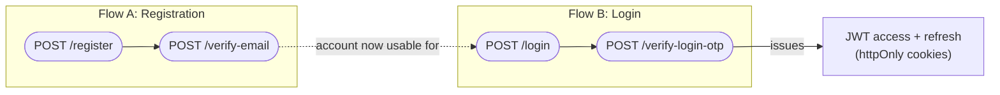
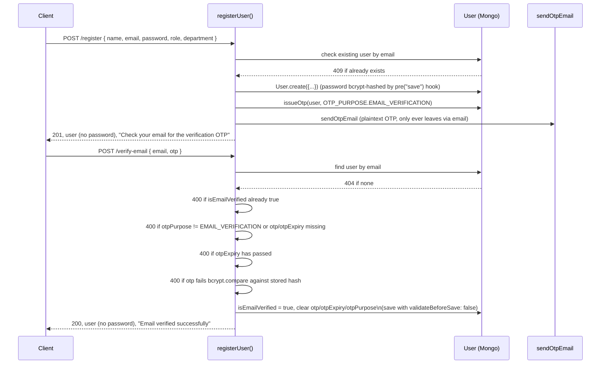

# Auth Module (Phase 1 / Phase 3 groundwork) — detailed

Files involved:

- `src/routes/auth.route.js`
- `src/controllers/auth.controller.js`
- `src/services/auth.service.js`
- `src/models/user.model.js`
- `src/middlewares/auth.middleware.js` (consumes the tokens this module issues)
- `src/utils/tokenGeneration.js`
- `src/utils/otp.js`
- `src/utils/mailer.js`
- `src/config/constants.js` (`OTP_PURPOSE`, `OTP_EXPIRY_MINUTES`)

This is not simple email+password login — it's a **two-step, OTP-gated flow** for both
registration and login. Nothing issues a session/JWT until an OTP sent to the user's
email has been verified.

## Routes (`src/routes/auth.route.js`)

```js
router.post("/register", register)
router.post("/verify-email", verifyEmail)
router.post("/login", login)
router.post("/verify-login-otp", verifyLogin)
```

All four are public (no `auth` middleware) — that's correct, since they're the
pre-authentication flow itself. Mounted at `/api/v1/auth` in `app.js`, so the live paths
are `/api/v1/auth/register`, `/api/v1/auth/verify-email`, `/api/v1/auth/login`,
`/api/v1/auth/verify-login-otp`.

## The two independent OTP flows

The `User` model has a single shared set of OTP fields (`otp`, `otpExpiry`,
`otpPurpose`) reused for two different purposes, disambiguated by `OTP_PURPOSE`
(`emailVerification` | `login`, from `constants.js`). Only one OTP can be "live" on a
user at a time — issuing a new one overwrites the old one's hash/expiry/purpose.



### Flow A: Registration + email verification



Note: `registerUser` does not enforce that `role`/`department` are consistent (e.g.
that only an admin can create another admin, or that a non-admin role has a
non-null `department`). There's no `auth`/`roleCheck` on `/register` at all — anyone
can self-register as any role. This is flagged in
[`known-issues.md`](./known-issues.md); `backend/Readme.md`'s planned API surface says
registration should be "Admin only."

### Flow B: Login (password check, then OTP, then tokens)

```mermaid
sequenceDiagram
    participant Client
    participant API as loginUser() / verifyLoginOtp()
    participant DB as User (Mongo)
    participant Mail as sendOtpEmail

    Client->>API: POST /login { email, password }
    API->>DB: find user by email
    DB-->>API: 401 "Invalid email or password" if not found
    API->>API: 401 same message if comparePassword() fails
    API->>API: 403 "Please verify your email before logging in" if !isEmailVerified
    API->>DB: issueOtp(user, OTP_PURPOSE.LOGIN)
    API->>Mail: sendOtpEmail
    API-->>Client: 200 { email }, "OTP sent..." — no tokens, no cookies yet

    Client->>API: POST /verify-login-otp { email, otp }
    API->>DB: find user by email
    DB-->>API: 401 "Invalid email or OTP" if not found
    API->>API: 400 if otpPurpose != LOGIN or otp/otpExpiry missing
    API->>API: 400 if otpExpiry has passed
    API->>API: 400 "Invalid OTP" if bcrypt compare fails
    API->>API: clear otp/otpExpiry/otpPurpose (in memory)
    API->>API: generateAccessToken(user), generateRefreshToken(user)
    API->>DB: refreshToken = bcrypt.hash(refreshToken, 10); save
    API-->>Client: 200 { user } + httpOnly accessToken/refreshToken cookies
```

1. `POST /login` — validates credentials, issues an OTP, but does **not** create a
   session (deliberately the same 401 message for "no such user" and "wrong password",
   so a caller can't tell which part was wrong).
2. `POST /verify-login-otp` — checks the OTP and only then mints tokens, hashing the
   refresh token before storing it (so the DB can't be used to replay a valid refresh
   token even if leaked), and strips the password before returning the user.

`loginUser` and `verifyLoginOtp` are two separate service calls corresponding to two
separate HTTP requests — the *password* check happens in `/login`, but the *session* is
only established in `/verify-login-otp`. This means a stolen password alone is
insufficient without also intercepting the OTP email — the OTP step functions as a
second factor, not just an email-verification gate.

## Cookie issuance (`src/controllers/auth.controller.js`)

Only `verifyLogin` sets cookies, since that's the point where tokens are minted:

```js
const cookieOptions = {
    httpOnly: true,                                 // not readable via document.cookie
    secure: process.env.NODE_ENV === "production",  // HTTPS-only in prod
    sameSite: "strict"                               // not sent on cross-site requests
}

res.cookie("accessToken", accessToken, { ...cookieOptions, maxAge: 15 * 60 * 1000 })       // 15m
   .cookie("refreshToken", refreshToken, { ...cookieOptions, maxAge: 7 * 24 * 60 * 60 * 1000 }) // 7d
```

The comment in the code notes these `maxAge` values are meant to match
`JWT_ACCESS_EXPIRY`/`JWT_REFRESH_EXPIRY` from `.env` — but they're hardcoded here, not
read from env, so if those env vars are ever changed the cookie `maxAge` and the JWT's
actual `exp` claim can silently drift out of sync (cookie could expire before/after the
token itself).

## Token generation (`src/utils/tokenGeneration.js`)

```js
generateAccessToken(user) -> jwt.sign({ id: user._id, role: user.role, department: user.department }, JWT_ACCESS_TOKEN, { expiresIn: JWT_ACCESS_EXPIRY })
generateRefreshToken(user) -> jwt.sign({ userId: user._id }, JWT_REFRESH_TOKEN, { expiresIn: JWT_REFRESH_EXPIRY })
```

The **access token's payload is what every downstream middleware relies on** — this is
the exact shape `auth.middleware.js` decodes into `req.user`, and it's why
`req.user.role`, `req.user.department`, and `req.user.id` are available everywhere
downstream (`roleCheck`, `deptScope`, `complaint.service.js`). The refresh token payload
(`userId`) is intentionally minimal (no role/department) since it should only ever be
used to mint a new access token, not to authorize actions directly. Note the field name
asymmetry: access token payload uses `id`, refresh token payload uses `userId` — there
is currently no refresh/rotate endpoint that would need to reconcile the two (see
[`known-issues.md`](./known-issues.md)).

Both secrets/expiries come straight from env vars: `JWT_ACCESS_TOKEN`,
`JWT_ACCESS_EXPIRY`, `JWT_REFRESH_TOKEN`, `JWT_REFRESH_EXPIRY` (per `CLAUDE.md` /
`backend/Readme.md`).

## OTP mechanics (`src/utils/otp.js`)

```js
generateOtp()       -> 6-digit numeric string, zero-padded (e.g. "004821")
hashOtp(otp)        -> bcrypt.hash(otp, 10)     stored on user.otp — plaintext OTP is
                                                  never persisted, only its hash
compareOtp(otp, hash) -> bcrypt.compare(otp, hash)
```

`issueOtp(user, purpose)` in `auth.service.js` ties these together:

```js
const otp = generateOtp()
user.otp = await hashOtp(otp)
user.otpExpiry = new Date(Date.now() + OTP_EXPIRY_MS)   // OTP_EXPIRY_MINUTES * 60_000, from constants.js
user.otpPurpose = purpose
await user.save({ validateBeforeSave: false })
await sendOtpEmail({ to: user.email, otp, purpose })     // plaintext otp only ever leaves via email
```

`OTP_EXPIRY_MINUTES` (10) lives in `constants.js` for the same centralization reason as
`ROLES`/`COMPLAINT_STATUS` — one place to tune OTP lifetime.

## Email dispatch (`src/utils/mailer.js`)

`sendOtpEmail({ to, otp, purpose })`:

- Builds a subject/body from `purpose` (`"login"` vs. anything else → verification
  wording) and `OTP_EXPIRY_MINUTES`-equivalent env var.
- Emits an `otp` event on a local `EventEmitter` (`otpEvents`) **before** attempting
  delivery — this is a deliberate test hook so `src/tests/auth.test.js` can subscribe
  and read the plaintext OTP without needing a real mailbox or SMTP server.
- Lazily builds a nodemailer transporter (`getTransporter()`), memoized in the module-
  level `transporter` variable. If `SMTP_HOST` isn't set in `.env`, it deliberately
  **doesn't** send real email — it logs `[mailer] SMTP not configured, OTP email to
  ${to}: ${text}` to the console instead. This is what makes local dev/test usable
  without real SMTP credentials.
- If SMTP *is* configured, sends via `transport.sendMail(...)` using `SMTP_HOST`,
  `SMTP_PORT` (default 587), `SMTP_SECURE`, `SMTP_USER`, `SMTP_PASS`, and `MAIL_FROM`
  (default `"LABMON <no-reply@labmon.local>"`) — none of which are currently listed in
  `CLAUDE.md`'s required `.env` values, since they're optional/dev-mode-friendly.

## `User` model fields relevant to auth (`src/models/user.model.js`)

```js
password:      String, required                     // bcrypt-hashed by pre("save") hook
role:          String, enum: Object.values(ROLES), required
department:    ObjectId -> Dept, default: null       // null for admin/deanInfra
refreshToken:  String                                // stores a bcrypt HASH, not the raw token
isEmailVerified: Boolean, default: false
otp:           String, select: false                 // excluded from queries by default
otpExpiry:     Date,   select: false
otpPurpose:    String, enum: Object.values(OTP_PURPOSE), select: false
```

`select: false` on the three OTP fields means a plain `User.findOne({ email })` will
**not** return them — `auth.service.js` explicitly opts back in with
`.select("+otp +otpExpiry +otpPurpose")` in both `verifyEmailOtp` and
`verifyLoginOtp`. This is a deliberate leak-reduction measure: any other code path that
fetches a user (e.g. the health-card/complaint flows, if they ever populate a user) gets
the OTP hash/expiry only if it explicitly asks for it.

```js
userSchema.pre("save", async function () {
    if (!this.isModified("password")) return
    this.password = await bcrypt.hash(this.password, 10)
})

userSchema.methods.comparePassword = async function (password) {
    return bcrypt.compare(password, this.password)
}
```

The `isModified("password")` guard means calling `.save()` for unrelated reasons (e.g.
`issueOtp`'s `user.save({ validateBeforeSave: false })`) does **not** re-hash an
already-hashed password.

## What `auth.middleware.js` does with all of this

See [`middlewares.md`](./middlewares.md#auth) for the consuming side — in short, it reads
`Authorization: Bearer <accessToken>`, verifies it with `JWT_ACCESS_TOKEN`, and sets
`req.user = decoded` (i.e. `{ id, role, department, iat, exp }`), which is what every
`roleCheck`/`deptScope`/service-layer department check downstream relies on.

## Notable gaps in this module (see also `known-issues.md`)

- **No refresh-token endpoint.** `refreshToken` is generated, hashed, and stored, but
  there's no route to redeem it for a new access token once the 15-minute access token
  expires — a user's only option today is to log in again.
- **No logout endpoint.** Nothing clears the `refreshToken` on the user or clears the
  cookies.
- **Registration is unauthenticated and unrestricted by role.** Anyone can `POST
  /register` with `role: "admin"`.
- **No "resend OTP" endpoint.** An expired registration OTP requires registering again
  (which will 409 on the duplicate email — see `known-issues.md`).
