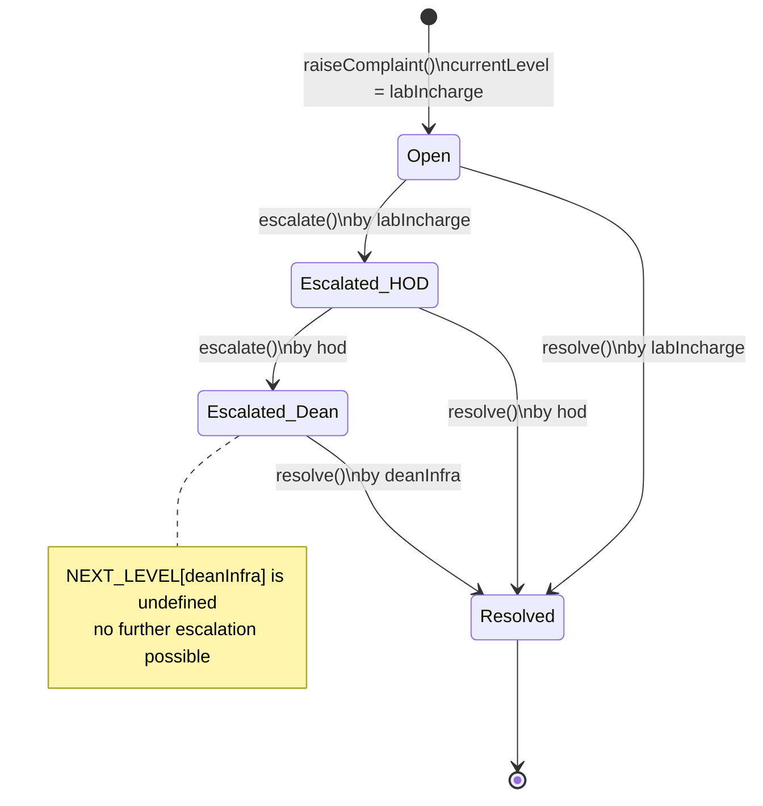
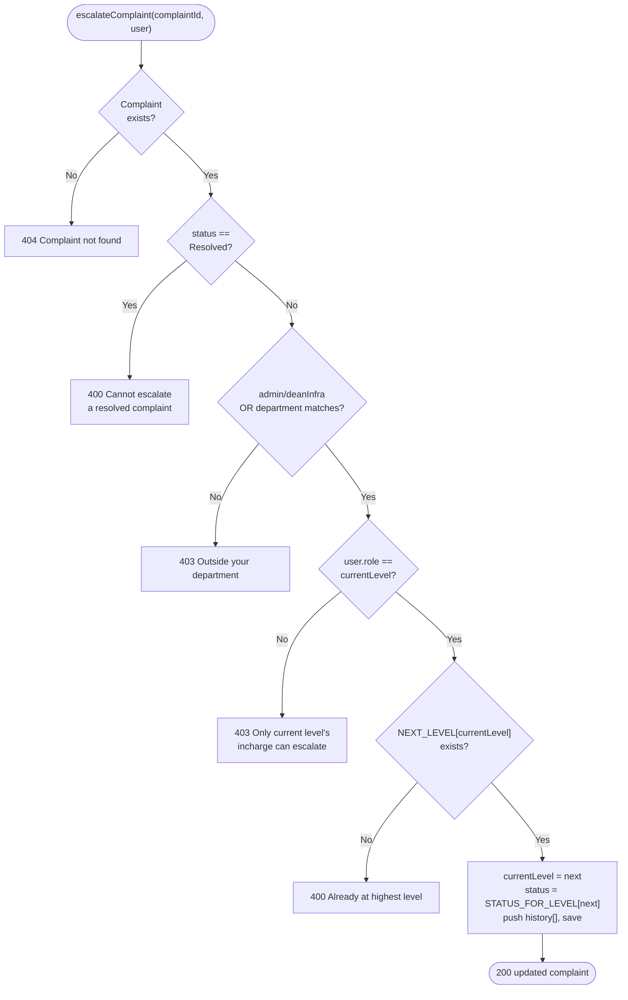

# Complaint Module — public submission and escalation, in detail

## Escalation state machine



`status` and `currentLevel` move together (`STATUS_FOR_LEVEL`/`NEXT_LEVEL` lookup
tables in `constants.js`): `Open` ↔ `labIncharge`, `Escalated_HOD` ↔ `hod`,
`Escalated_Dean` ↔ `deanInfra`. Resolution can happen from **any** level, not just the
top — `currentLevel` simply freezes at whichever level closed it.

Files involved:

- `src/routes/complaint.route.js`
- `src/controllers/complaint.controller.js`
- `src/services/complaint.service.js`
- `src/models/complaint.model.js`
- `src/config/constants.js` (`ROLES`, `COMPLAINT_STATUS`, `NEXT_LEVEL`,
  `STATUS_FOR_LEVEL`)
- `src/middlewares/auth.middleware.js`, `src/middlewares/roleCheck.middleware.js`
- `src/middlewares/rateLimiter.js` (`complaintLimiter`), `src/middlewares/validate.middleware.js`
- `src/validators/complaint.validator.js`, `src/validators/common.validator.js`
- `src/utils/scope.js` (`assertDepartmentAccess`, `buildComplaintScope`)

## Routes (`src/routes/complaint.route.js`)

```js
router.post("/", complaintLimiter, validate(raiseComplaintSchema), raiseComplaint); // public
router.patch(
  "/:id/escalate",
  auth,
  roleCheck(ROLES.LAB_INCHARGE, ROLES.HOD),
  validate(objectIdParamSchema, "params"),
  escalateComplaint,
);
router.patch(
  "/:id/resolve",
  auth,
  roleCheck(ROLES.LAB_INCHARGE, ROLES.HOD, ROLES.DEAN_INFRA),
  validate(objectIdParamSchema, "params"),
  validate(resolveComplaintSchema),
  resolveComplaint,
);
```

Mounted (via `app.js`) at `/api/v1/complaint`.

The public `POST /` is throttled by `complaintLimiter` (20/hour by default) and validated
by `raiseComplaintSchema` (shape/type checks on `deadStockNo`, `description`, and
`raisedBy.{name,contact}`) before `createComplaint` runs — see
[`middlewares.md`](./middlewares.md). `escalate`/`resolve` validate `:id` the same way
`health-card` does now (`objectIdParamSchema`), and `resolve` additionally validates its
optional `remarks` body field.

Also registered but omitted from the snippet above: `router.get("/track/:token", track)`
(public tracking lookup) and `router.get("/", auth, list)` (role-scoped listing).

- `raiseComplaint` and `track` are deliberately public — anyone (a student, a lab
  visitor) can file a complaint without an account and check on it later via the token,
  per the product goal of "public, login-free complaint submission tracked by a unique
  token."
- `escalate`/`resolve` both require `auth` + `roleCheck`. `roleCheck` only checks the
  _role_ is one of the allowed set — the actual "is this the right person for _this_
  complaint" check (current level match, department match) happens inside the service
  (see below), not in middleware.
- `list` requires only `auth` — it does **not** go through the `deptScope` middleware.
  Scoping is computed entirely inside `getComplaints(user)` via `buildComplaintScope`
  (see below), because plain department-scoping isn't expressive enough here: HOD and
  Dean Infra additionally need to see only complaints currently sitting _at their level_,
  not their department's/everyone's full history. `deptScope` remains in use only on the
  PC health-card route — see [`middlewares.md`](./middlewares.md#deptscope).

## Controller (`src/controllers/complaint.controller.js`)

```js
const raiseComplaint = asyncHandler(async (req, res) => {
  const complaint = await createComplaint(req.body);
  return res.status(201).json(new ApiResponse(201, complaint, "Complaint raised successfully"));
});

const escalateComplaint = asyncHandler(async (req, res) => {
  if (!mongoose.Types.ObjectId.isValid(req.params.id)) {
    throw new ApiError(400, "Invalid complaint id");
  }
  const complaint = await escalateComplaintService(req.params.id, req.user);
  return res.status(200).json(new ApiResponse(200, complaint, "Complaint escalated successfully"));
});

const resolveComplaint = asyncHandler(async (req, res) => {
  if (!mongoose.Types.ObjectId.isValid(req.params.id)) {
    throw new ApiError(400, "Invalid complaint id");
  }
  const complaint = await resolveComplaintService(req.params.id, req.user, req.body.remarks);
  return res.status(200).json(new ApiResponse(200, complaint, "Complaint resolved successfully"));
});
```

Both `escalateComplaint` and `resolveComplaint` validate `req.params.id` is a well-formed
ObjectId **before** calling the service, giving a clean `400` on a malformed id instead
of letting `Complaint.findById` throw an uncaught Mongoose `CastError` inside the service
(which isn't an `ApiError`, so it would otherwise fall through to `errorHandler`'s
generic `500`). The PC module's `getPcHealthCard` still has this gap unaddressed — see
[`known-issues.md`](./known-issues.md).

The two service functions are imported with aliases
(`escalateComplaint as escalateComplaintService`, `resolveComplaint as
resolveComplaintService`) specifically because the controller functions in this file
share the same names as the service functions — a naming collision resolved via import
aliasing rather than renaming one side.

## Service (`src/services/complaint.service.js`)

### `createComplaint({ deadStockNo, description, raisedBy })`

```js
const pc = await Pc.findOne({ deadStockNo });
if (!pc) throw new ApiError(404, "PC not found");

const complaintToken = nanoid(8);

const complaint = await Complaint.create({
  token: complaintToken,
  pc: pc._id,
  department: pc.department,
  lab: pc.lab,
  description,
  raisedBy,
  status: COMPLAINT_STATUS.OPEN,
  currentLevel: ROLES.LAB_INCHARGE,
  history: [{ level: ROLES.LAB_INCHARGE, action: "created", by: null, at: new Date() }],
});
```

- The caller supplies a **`deadStockNo`**, not a `pc` ObjectId or a `department`/`lab` —
  this is exactly the identifier printed on the physical machine, so a person reporting
  a broken lab PC doesn't need to know any internal IDs.
- `department` and `lab` on the complaint are **derived from the PC**, not supplied by
  the caller — this is what makes department-scoping of complaints trustworthy later
  (a public caller can't lie about which department a complaint belongs to).
- `token = nanoid(8)` — an 8-character random token, this is the "unique token" the
  product spec refers to for public complaint tracking. `GET /complaints/track/:token`
  (`trackComplaint` below) looks a complaint up by this token, returning a trimmed
  `token status currentLevel description createdAt` projection.
- The first `history[]` entry has `by: null` — there is no authenticated user behind a
  public complaint creation, so there's nothing to attribute the "created" action to.
  Every subsequent history entry (escalate/resolve) has `by: user.id` from the
  authenticated `req.user`.
- `raisedBy` is `{ name, contact }`, both required at the schema level — this is how the
  system can get back in touch with whoever filed the complaint, since there's no user
  account tying to it.

### `escalateComplaint(complaintId, user)`



```js
// assertDepartmentAccess now lives in src/utils/scope.js, shared with deptScope
// middleware and buildComplaintScope below — see utils.md#scope-srcutilsscopejs
const complaint = await Complaint.findById(complaintId);
if (!complaint) throw new ApiError(404, "Complaint not found");
if (complaint.status === COMPLAINT_STATUS.RESOLVED)
  throw new ApiError(400, "Cannot escalate a resolved complaint");
assertDepartmentAccess(
  user,
  complaint.department,
  "You are not authorized to escalate complaints outside your department",
);
if (user.role !== complaint.currentLevel) {
  throw new ApiError(403, "Only the current level's incharge can escalate this complaint");
}
const nextLevel = NEXT_LEVEL[complaint.currentLevel];
if (!nextLevel) throw new ApiError(400, "Complaint is already at the highest escalation level");

complaint.currentLevel = nextLevel;
complaint.status = STATUS_FOR_LEVEL[nextLevel];
complaint.history.push({ level: nextLevel, action: "escalated", by: user.id, at: new Date() });
await complaint.save();
await complaint.populate([
  { path: "lab", select: "name" },
  { path: "department", select: "name" },
  { path: "history.by", select: "name" },
]);
```

Five checks, in order, each a distinct failure mode:

1. **Existence** (`404`) — complaint id doesn't resolve to a document.
2. **Terminal state** (`400`) — can't escalate something already `Resolved`. Note there
   is no analogous "already at Escalated_Dean, can't re-escalate to the same status"
   check needed here — that's handled by check 4 below via `NEXT_LEVEL` returning
   `undefined`.
3. **Department scope** (`403`) — `String(...)` coercion on both sides is required
   because `complaint.department` is a Mongoose ObjectId instance while `user.department`
   is whatever the JWT payload carried (a string, since JWTs only carry JSON-
   serializable data) — comparing them without stringifying both would use object
   identity (or `ObjectId.toString()` implicitly on one side only) and could produce
   surprising results. `ROLES.ADMIN` and `ROLES.DEAN_INFRA` both bypass this check
   entirely — an admin or Dean Infra user can escalate any complaint in any department,
   matching `deptScope` middleware's treatment of those two roles as unscoped (see
   [`middlewares.md`](./middlewares.md#deptscope)).
4. **Current-level match** (`403`) — this is the actual authorization core of the
   escalation chain: only the _specific_ role holding a complaint right now
   (`complaint.currentLevel`) can move it forward, not just "any Lab Incharge or HOD
   anywhere." E.g. an HOD cannot escalate a complaint that's still sitting with Lab
   Incharge — only the Lab Incharge (of the right department, per check 3) can do that
   first hop.
5. **Top of chain** (`400`) — `NEXT_LEVEL[DEAN_INFRA]` is `undefined` (no entry in the
   lookup table — see [`constants.md`](./constants.md)), so this is how "there's no
   level above Dean Infra" is expressed without a special-cased `if`.

Then: mutate `currentLevel` and `status` together (from the two lookup tables), append a
`history` entry attributing the action to the acting user, save.

### `resolveComplaint(complaintId, user, remarks)`

```js
const complaint = await Complaint.findById(complaintId);
if (!complaint) throw new ApiError(404, "Complaint not found");
if (complaint.status === COMPLAINT_STATUS.RESOLVED)
  throw new ApiError(400, "Complaint is already resolved");
assertDepartmentAccess(
  user,
  complaint.department,
  "You are not authorized to resolve complaints outside your department",
);
if (user.role !== complaint.currentLevel) {
  throw new ApiError(403, "Only the current level's incharge can resolve this complaint");
}
complaint.status = COMPLAINT_STATUS.RESOLVED;
complaint.history.push({
  level: complaint.currentLevel,
  action: "resolved",
  by: user.id,
  at: new Date(),
  note: remarks,
});
await complaint.save();
await complaint.populate([
  { path: "lab", select: "name" },
  { path: "department", select: "name" },
  { path: "history.by", select: "name" },
]);
```

Same four checks as escalation (existence, terminal state, department scope,
current-level match) minus the "top of chain" check, since resolving doesn't move
`currentLevel` at all — `currentLevel` freezes at whatever level resolved it (useful for
knowing _who_ closed it later, from `history` too). `remarks` (from `req.body.remarks`
in the controller) is optional — the schema's `history[].note` field has no `required`
constraint — and is stored as the `note` on the "resolved" history entry.

**Escalate and resolve share the same current-level-match rule** — this means at _any_
given level in the chain, the incharge holding the complaint can choose to either push it
up (`escalate`) or close it out (`resolve`) themselves; there's no separate "only the top
level can mark resolved" rule. That matches the product framing ("escalating through a
fixed chain") where resolution can happen at any point in the chain, not just at the end.

### `trackComplaint(token)`

```js
const complaint = await Complaint.findOne({ token }).select(
  "token status currentLevel description createdAt",
);
if (!complaint) throw new ApiError(404, "Invalid tracking token");
```

Public lookup, deliberately projected down to a small field set — no `department`/`lab`/
`history`/`raisedBy` leaked back to an unauthenticated caller who only has the token.

### `getComplaints(user)`

```js
// buildComplaintScope now lives in src/utils/scope.js (shared with deptScope
// middleware and assertDepartmentAccess) — see utils.md#scope-srcutilsscopejs
// admin sees everything; labIncharge sees their department's whole queue;
// hod/deanInfra only see complaints currently escalated to their level (department-
// scoped for hod, across all departments for deanInfra)
const buildComplaintScope = (user) => {
  if (user.role === ROLES.ADMIN) return {};
  if (user.role === ROLES.DEAN_INFRA) return { currentLevel: ROLES.DEAN_INFRA };
  if (user.role === ROLES.HOD) return { department: user.department, currentLevel: ROLES.HOD };
  return { department: user.department };
};

const getComplaints = async (user) => {
  const scope = buildComplaintScope(user);
  return Complaint.find(scope)
    .sort({ createdAt: -1 })
    .populate("lab", "name")
    .populate("department", "name")
    .populate("history.by", "name");
};
```

Scoping is computed from the _authenticated user's role_, not a shared `deptScope`
middleware — a plain department filter isn't enough here, because HOD and Dean Infra
should only see complaints currently sitting **at their level**, not every complaint
ever raised in their department/system. Concretely:

- `admin` — everything, no filter.
- `labIncharge` — every complaint in their own department, at any level (they raised/
  handle the whole department queue).
- `hod` — only their department's complaints where `currentLevel === "hod"`; a
  complaint still with the Lab Incharge, or already resolved/escalated past HOD, is not
  in this view.
- `deanInfra` — only complaints where `currentLevel === "deanInfra"`, across **all**
  departments (Dean Infra is unscoped by department, same as `admin`, but still filtered
  to their own level).

Returns an array, newest first — an empty array (no matching complaints) is a valid
`200` result, not a `404`, since "nothing currently at your level" isn't an error
condition for a listing endpoint.

`department` (like `lab`) is populated down to `{ _id, name }` rather than left as a raw
ObjectId — added for the Dean Infra frontend dashboard, which is cross-department and
needs to show which department each complaint belongs to (Lab Incharge/HOD don't need
this, since their lists are already department-scoped).

## Model (`src/models/complaint.model.js`)

```js
token:        String, required, unique              // nanoid(8), public tracking id
pc:           ObjectId -> Pc, required
department:   ObjectId -> Dept, required             // copied from Pc at creation
lab:          ObjectId -> Lab, required               // copied from Pc at creation
description:  String, required
raisedBy:     { name: String required, contact: String required }
status:       enum(COMPLAINT_STATUS values), default COMPLAINT_STATUS.OPEN
currentLevel: enum(ROLES values minus ADMIN), default ROLES.LAB_INCHARGE
history: [{
  level:  String,
  action: String,
  by:     ObjectId -> User,
  at:     Date default now,
  note:   String
}]
```

`currentLevel`'s enum is built as `Object.values(ROLES).filter(r => r !== ROLES.ADMIN)` —
excluding `ADMIN` from the _set of values this field can hold_ is correct (a complaint
is never "held by" the admin role as a chain position), even though `ADMIN` users are
still allowed to _act on_ complaints at any level via the `user.role !== ROLES.ADMIN`
bypass checks in the service layer above. Those are two different things: what
`currentLevel` can be set to, vs. who is authorized to change it.

## What's explicitly not built yet in this module

Phase 3 (raise, track, escalate, resolve, list) is complete — see
[`phases.md`](./phases.md). What's left is Phase 4 dashboard functionality on top of the
existing `list` endpoint: query-param filtering (by `status`/`currentLevel`), pagination,
and summary counts. `GET /complaints` today returns the full department-scoped result
set with no filtering or paging.

Also still true: `list` doesn't use the `deptScope` middleware — its role/level-aware
scoping (`buildComplaintScope`) is called from `complaint.service.js`, separately from
`escalate`/`resolve`'s `assertDepartmentAccess` call and from `deptScope` middleware
(used only on the PC health-card route). All three now share one implementation in
`src/utils/scope.js` rather than independently re-deriving the same admin/Dean-Infra-
unscoped rule — see [`utils.md`](./utils.md#scope-srcutilsscopejs) and
[`middlewares.md`](./middlewares.md#deptscope).
