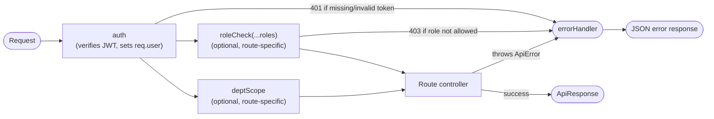

# Middlewares (`src/middlewares/`)

Four middleware modules exist. `auth` → `roleCheck`/`deptScope` are meant to run in that
order on any protected route (auth must populate `req.user` before the other two can use
it). `errorHandler` is global and mounted last in `app.js`.



## `auth` — `src/middlewares/auth.middleware.js`

```js
const auth = (req, res, next) => {
    const authHeader = req.headers.authorization
    const headerToken = authHeader?.startsWith("Bearer") ? authHeader.split(" ")[1] : null
    const token = headerToken || req.cookies?.accessToken

    if (!token) {
        throw new ApiError(401, "Authentication required")
    }
    try {
        const decoded = jwt.verify(token, process.env.JWT_ACCESS_TOKEN)
        req.user = decoded
        next()
    } catch (error) {
        throw new ApiError(401, "Invalid or expired token")
    }
}
```

- Reads `Authorization: Bearer <token>` first; if that header is missing or not a
  Bearer scheme, falls back to the `accessToken` httpOnly cookie set at login (see
  [`auth-module.md`](./auth-module.md)) — either credential source works, so a
  browser client relying purely on the cookie and an API client sending an explicit
  header both authenticate the same way. Neither present → `401`.
- Verifies the JWT against `JWT_ACCESS_TOKEN` (the same secret
  `generateAccessToken` in `tokenGeneration.js` signs with).
- On success, sets `req.user` to the **decoded payload**, i.e. exactly
  `{ id, role, department, iat, exp }` (see [`auth-module.md`](./auth-module.md) for the
  payload shape). This is why every downstream consumer reads `req.user.role`,
  `req.user.department`, `req.user.id` — those are JWT claims, not a fresh DB lookup.
  There is no re-fetch of the `User` document here, so if a user's role/department
  changes in the DB after a token was issued, `req.user` still reflects the old values
  until the token expires and they log in again.
- Any verification failure (expired, malformed, wrong signature) → `401 "Invalid or
  expired token"`.
- Note: `auth` throws synchronously (not via `asyncHandler`), which works here because
  Express 5's default routing catches synchronous throws in middleware — but it's
  inconsistent with the rest of the codebase's `asyncHandler` convention. It happens to
  work today because nothing here is genuinely async (`jwt.verify` used synchronously).

## `roleCheck` — `src/middlewares/roleCheck.middleware.js`

```js
const roleCheck = (...allowedRoles) => {
    return (req, res, next) => {
        if (!allowedRoles.includes(req.user.role)) {
            throw new ApiError(403, "You do not have permission to perform this action")
        }
        next()
    }
}
```

- A middleware **factory** — called with a list of allowed role strings at route-
  definition time, e.g. `roleCheck(ROLES.LAB_INCHARGE, ROLES.HOD)`, and returns the
  actual middleware function.
- Requires `req.user` to already be populated — **must run after `auth`**. If mounted
  without `auth` first, `req.user` is `undefined` and `req.user.role` throws a
  `TypeError` instead of a clean `ApiError` (an unhandled crash, not a 403 — the route
  wiring is what prevents this today; there's no defensive check inside the middleware
  itself).
- Used in `src/routes/complaint.route.js`:
  - `escalate`: `roleCheck(ROLES.LAB_INCHARGE, ROLES.HOD)` — Dean Infra is excluded
    because there is no level above Dean Infra to escalate *to*.
  - `resolve`: `roleCheck(ROLES.LAB_INCHARGE, ROLES.HOD, ROLES.DEAN_INFRA)` — any level
    in the chain can resolve.
- Not currently used on any PC route — `pc.route.js` relies on `deptScope` alone for the
  health-card endpoint, with no role restriction beyond "authenticated."

## `deptScope` — `src/middlewares/deptScope.middleware.js`

```js
const deptScope = (req, res, next) => {
    if (req.user.role === ROLES.ADMIN || req.user.role === ROLES.DEAN_INFRA) {
        req.scope = {}
    } else {
        req.scope = { department: req.user.department }
    }
    next()
}
```

- Also requires `req.user` from `auth` to already be set.
- Produces `req.scope`, a **Mongoose filter fragment** meant to be spread into a query:
  - Admin and Dean Infra get `req.scope = {}` — no department restriction, since both
    roles operate across all departments (`department: null` on their `User` docs
    confirms this — see `models.md`).
  - Everyone else (`labIncharge`, `hod`) gets `req.scope = { department:
    req.user.department }` — restricts to their own department only.
- Consumed today by exactly one route: `pc.route.js`'s `POST /:id/health-card`, where
  `pc.service.js`'s `getPcHealthCard(pcId, scope)` does `Pc.findOne({ _id: pcId,
  ...scope })`. Spreading `{}` is a no-op filter (matches any department); spreading
  `{ department: X }` narrows the match. If a non-admin/non-Dean user requests a PC in
  another department, the `_id` matches but `department` doesn't, so `findOne` returns
  `null` and the service throws `404 "Pc not found"` — **not** a `403`. This is a
  deliberate (or at least consistent) choice: out-of-scope resources look identical to
  nonexistent ones, avoiding confirming to a caller that a specific `_id` exists in a
  department they can't see.
- **Not** used on the complaint `list`/`escalate`/`resolve` routes. `list` computes its
  own role/level-aware scope inside `complaint.service.js`'s `buildComplaintScope`
  (department scoping alone isn't expressive enough there — HOD/Dean Infra additionally
  need to see only complaints currently at *their* level); `escalate`/`resolve` do their
  own inline `assertDeptAccess` check. All three (`deptScope`, `buildComplaintScope`,
  `assertDeptAccess`) independently re-derive the same "admin/Dean-Infra are unscoped,
  everyone else is department-locked" rule — behaviorally consistent, but three separate
  places to keep in sync if that rule ever changes. See
  [`complaint-module.md`](./complaint-module.md) and
  [`known-issues.md`](./known-issues.md).

## `errorHandler` — `src/middlewares/error.middleware.js`

```js
const errorHandler = (err, req, res, next) => {
    if (err instanceof ApiError) {
        return res.status(err.statusCode).json({
            success: false,
            statusCode: err.statusCode,
            message: err.message,
            errors: err.errors
        })
    }
    console.error(err)
    return res.status(500).json({
        success: false,
        statusCode: 500,
        message: "Internal Server Error",
        errors: []
    })
}
```

- Express error-handling middleware (4-arg signature — the arity is what tells Express
  to treat it as an error handler rather than a normal middleware). Mounted last in
  `app.js`, after all routers.
- Two branches:
  - Known errors (`ApiError` instances, thrown anywhere in a controller/service/
    middleware and forwarded here via `asyncHandler`'s `.catch(next)` or a synchronous
    `throw` inside route-stack code) → passed through as-is: their own `statusCode`,
    `message`, and `errors` array.
  - Anything else (a raw `TypeError`, a Mongoose `ValidationError`/`CastError`, etc.) →
    logged server-side with `console.error`, and the client gets a generic `500`
    without leaking internal error details.
- This is what lets every controller/service just `throw new ApiError(...)` freely
  without a local `try/catch` — as long as the handler is wrapped in `asyncHandler` (for
  async code) so the rejection actually reaches `next(err)` and thus this middleware.

## Composition example

`pc.route.js`:

```js
router.post("/:id/health-card", auth, deptScope, PcHealthCard)
```

Order matters: `auth` must run first to populate `req.user`; `deptScope` reads
`req.user.role`/`req.user.department` to build `req.scope`; `PcHealthCard` (the
controller) reads both `req.params.id` and `req.scope`.

`complaint.route.js`:

```js
router.patch("/:id/escalate", auth, roleCheck(ROLES.LAB_INCHARGE, ROLES.HOD), escalateComplaint)
router.patch("/:id/resolve", auth, roleCheck(ROLES.LAB_INCHARGE, ROLES.HOD, ROLES.DEAN_INFRA), resolveComplaint)
router.get("/", auth, list)
```

None of the complaint routes use `deptScope` — `escalate`/`resolve` use `roleCheck` for
the coarse "is this role allowed at all" check, then an inline department check inside
the service layer; `list` computes its own role/level-aware scope entirely inside
`complaint.service.js` (see the `deptScope` section above). `deptScope` middleware
itself is only wired into the PC health-card route today.
