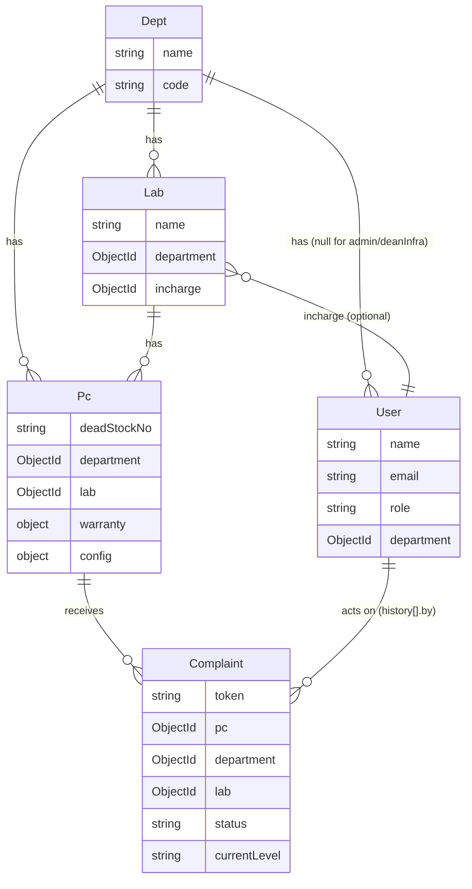

# Data Models (`src/models/`)

Five Mongoose models. Relationships:



## `Dept` — `src/models/department.model.js`

```js
name: String, required, unique, trim
code: String, required, trim, uppercase
```

The top of the org hierarchy — every `Lab`, non-admin/Dean `User`, and `Pc` belongs to
exactly one `Dept`. `code` is auto-uppercased by Mongoose (`uppercase: true`), so
callers don't need to normalize casing themselves.

## `Lab` — `src/models/lab.model.js`

```js
name:       String, required, trim
department: ObjectId -> Dept, required
incharge:   ObjectId -> User
```

`incharge` is the `User` (expected to have `role: ROLES.LAB_INCHARGE`) responsible for
this lab — this is who a complaint's `currentLevel` first routes to, though nothing in
the current code actually looks up `Lab.incharge` to resolve *which specific user*
should act on a complaint; `escalateComplaint`/`resolveComplaint` authorize by
`role === currentLevel` + department match, not by cross-referencing this field. Note
`incharge` has no `required: true` — a lab can exist without an assigned incharge.

## `User` — `src/models/user.model.js`

```js
name:            String, required
email:           String, required, unique, lowercase, trim, validated via `validator.isEmail`
department:      ObjectId -> Dept, default: null       // null for admin/deanInfra
password:        String, required                       // bcrypt-hashed pre-save
role:            String, enum: Object.values(ROLES), required
refreshToken:    String                                  // bcrypt HASH of the refresh token
isEmailVerified: Boolean, default: false
otp:             String, select: false
otpExpiry:       Date,   select: false
otpPurpose:      String, enum: Object.values(OTP_PURPOSE), select: false
```

Full detail on the auth-related fields (`password`, `refreshToken`, the OTP trio) and
the `pre("save")` hashing hook / `comparePassword` method is in
[`auth-module.md`](./auth-module.md#user-model-fields-relevant-to-auth) — this section
covers the schema shape only.

`department: default: null` is what encodes "admin and Dean Infra operate across all
departments" at the data level — `deptScope` middleware's admin/Dean-Infra branch
(`req.scope = {}`) exists precisely because these users' `department` is meaningless as
a filter.

## `Pc` — `src/models/pc.model.js`

```js
deadStockNo:  String, required, unique
department:   ObjectId -> Dept, required
lab:          ObjectId -> Lab, required
warranty: {
  status:     enum("Active","Expired"), default "Active"
  expiryDate: Date
}
purchaseDate: Date
config: {
  cpu: String, ram: String, disk: String, os: String,
  software: [String],
  lastSyncedAt: Date
}
```

`deadStockNo` is the physical asset tag and the natural key the Python agent and public
complaint form both key off of (neither needs to know the Mongo `_id`). `config` is the
embedded subdocument the agent syncs field-by-field on every sync (only keys present in
the payload are `$set`, so a partial payload no longer wipes the rest) — full detail in
[`pc-module.md`](./pc-module.md#model-srcmodelspcmodeljs). `warranty.status` is a plain
enum with a default, not derived from `expiryDate` — nothing currently auto-flips it to
`"Expired"` when `expiryDate` passes; that would need to be either a scheduled job or a
computed field, neither of which exists yet.

## `Complaint` — `src/models/complaint.model.js`

```js
token:        String, required, unique                 // nanoid(8)
pc:           ObjectId -> Pc, required
department:   ObjectId -> Dept, required                // copied from Pc at creation time
lab:          ObjectId -> Lab, required                 // copied from Pc at creation time
description:  String, required
raisedBy:     { name: String required, contact: String required }
status:       enum(COMPLAINT_STATUS values), default "Open"
currentLevel: enum(ROLES values minus ADMIN), default ROLES.LAB_INCHARGE
history: [{ level: String, action: String, by: ObjectId -> User, at: Date default now, note: String }]
```

Full escalation-flow detail (why `department`/`lab` are copied rather than referenced
transitively via `pc`, why `currentLevel`'s enum excludes `ADMIN`, how `history` gets
built up) is in [`complaint-module.md`](./complaint-module.md). The short version of why
`department`/`lab` are denormalized onto the complaint itself rather than requiring a
`.populate("pc")` to find them: it lets every department-scope check
(`String(complaint.department) !== String(user.department)`) run against the complaint
document directly, no join needed.

## Timestamps

All five schemas pass `{ timestamps: true }`, so every document gets Mongoose-managed
`createdAt`/`updatedAt` fields automatically — none of the models declare these fields
manually.

## Indexes

Implicit unique indexes from `unique: true` on `Dept.name`, `User.email`,
`Pc.deadStockNo`, `Complaint.token`, plus two explicit compound/single-field indexes on
`Pc`: `{ department: 1, lab: 1 }` (scoped listing) and `{ "warranty.status": 1 }`. No
indexes have been added on `Complaint` yet (e.g. `{ department, status }` for a
dashboard query) — relevant once Phase 4 (dashboards) is built.
