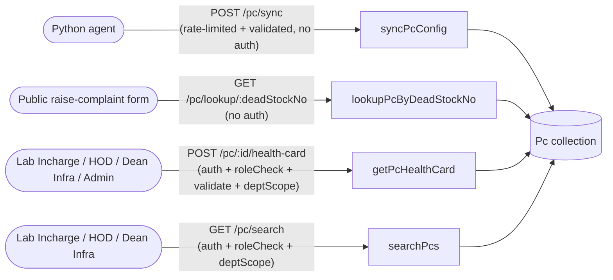

# PC Module

Covers `src/services/pc.service.js`, its endpoints in `src/routes/pc.route.js` / `src/controllers/pc.controller.js`, all mounted at `/api/v1/pc`, and operating on the `Pc` model (`src/models/pc.model.js`).

## Endpoint overview



## `syncPcConfig(payload)` -> `POST /api/v1/pc/sync`

Agent-facing endpoint. Still no auth middleware (device-key auth is planned, not
implemented — see [`known-issues.md`](./known-issues.md)), but the route is now behind
`pcSyncLimiter` (30 requests/min by default, throttling abuse in the absence of real
device auth) and `validate(syncPcSchema)`, which rejects a malformed body (missing/blank
`deadStockNo`, wrong types) with a `400` before it reaches the service — see
[`middlewares.md`](./middlewares.md#validate).

- Requires `payload.deadStockNo`; throws `400` (`"deadStockNo is required"`) if missing.
- Builds a field-by-field `configSet` from `payload.config` (only keys present and `!== undefined` are included as individual `config.<key>` paths), so an omitted field is left untouched rather than wiped — this is a merge, not a whole-subdocument overwrite. `config.lastSyncedAt` is always stamped server-side with `new Date()`, ignoring/overwriting whatever the agent sent for that field.
- **Existing PC** (`deadStockNo` already provisioned): applies `configSet` via `$set`. If `payload.department` and/or `payload.lab` are also provided, they're resolved and updated too (`department` via `resolveDepartmentId`, `lab` via `resolveOrCreateLabId`) — this lets a technician correct a mis-assigned PC's department/lab from the agent prompt. Omitting them leaves the existing department/lab untouched. Returns the updated document (`{ returnDocument: "after" }`).
- **No PC with that `deadStockNo` yet** (first-time provisioning): requires `payload.department`, else throws `404` (`"PC not found. Check dead stock number."`) — preserves the original "unknown PC" behavior for a plain sync with no department. If `department` is given but `payload.lab` is missing, throws `400` (`"lab is required when provisioning a new PC"`). With both present, creates a new `Pc` with `warranty.status: "Active"` and the collected `config`.
- `resolveDepartmentId(name)` looks up `Dept.findOne({ name })` (trimmed) and throws `404` if not found — departments are a fixed, pre-seeded list, never auto-created.
- `resolveOrCreateLabId(name, departmentId)` does a `findOneAndUpdate` with `upsert: true` on `{ name, department }` — labs are ad-hoc, department-scoped, and auto-created on first mention.

## `lookupPcByDeadStockNo(deadStockNo)` -> `GET /api/v1/pc/lookup/:deadStockNo`

Public, unauthenticated — used by the login-free raise-complaint form to confirm a dead stock number is real and preview its department/lab before the complainant submits.

- Trims `deadStockNo`; throws `400` (`"deadStockNo is required"`) if blank.
- `Pc.findOne({ deadStockNo }).select("deadStockNo department lab").populate("department", "name").populate("lab", "name")` — deliberately narrow projection, doesn't leak `config`/`warranty`.
- Throws `404` (`"PC not found. Check dead stock number."`) if no match.

## `getPcHealthCard(pcId, scope)` -> `POST /api/v1/pc/:id/health-card`

`auth`, `roleCheck(LAB_INCHARGE, HOD, DEAN_INFRA, ADMIN)`, `validate(objectIdParamSchema, "params")`, `deptScope`.

`roleCheck` was added here as part of a security-hardening pass — previously this route
had no role restriction at all, so any authenticated user of any role could fetch a
health card (department-scoped only, via `deptScope`). The role list is a **superset**
of `GET /pc/search`'s (which deliberately excludes `admin` — see `pc.search.test.js`),
not a copy of it, since `healthcard.test.js` expects admin to succeed here. See
[`known-issues.md`](./known-issues.md).

- `validate(objectIdParamSchema, "params")` rejects a malformed `:id` with a `400` before
  the controller runs, ahead of (and overlapping with) the service's own
  `mongoose.Types.ObjectId.isValid` check below.
- Validates `pcId` is a valid Mongo ObjectId first (`mongoose.Types.ObjectId.isValid`), throwing a clean `400` (`"Invalid PC id"`) instead of letting a malformed id fall through to an uncaught Mongoose `CastError` / generic `500`.
- `Pc.findOne({ _id: pcId, ...scope })` - `scope` comes from `deptScope` (`{}` for admin/deanInfra, `{ department: req.user.department }` otherwise), so a labIncharge/hod requesting a PC outside their department gets the same `404` as a nonexistent id.
- Throws `404` (`"Pc not found"`) if no match.
- Returns the full PC document (deadStockNo, department, lab, warranty, purchaseDate, config).

## `searchPcs(queryParams, scope)` -> `GET /api/v1/pc/search`

`auth`, `roleCheck(labIncharge, hod, deanInfra)`, `deptScope`. Lets Lab Incharge/HOD/Dean Infra look up PCs by hardware, software, dead stock number, or warranty status without needing the exact `_id`.

**Scoping**: same `deptScope` idiom as above - `req.scope = {}` for admin/deanInfra (search across all departments), `req.scope = { department: req.user.department }` for labIncharge/hod (restricted to their own department). There is no lab-level restriction - labIncharge and hod both see their whole department's PCs, not just their own lab, since `User` has no `lab` field.

**Query params** (all optional; an empty query returns every PC in scope, sorted newest-first by `createdAt`):

| Param | Match type | Field | Notes |
|---|---|---|---|
| `deadStockNo` | partial, case-insensitive | `deadStockNo` | regex-escaped |
| `cpu` | partial, case-insensitive | `config.cpu` | regex-escaped |
| `ram` | partial, case-insensitive | `config.ram` | regex-escaped |
| `disk` | partial, case-insensitive | `config.disk` | regex-escaped |
| `os` | partial, case-insensitive | `config.os` | regex-escaped |
| `software` | partial, case-insensitive | `config.software` | matches if any array element contains the substring |
| `warrantyStatus` | exact | `warranty.status` | must be `Active` or `Expired`, else `400` |
| `lab` | exact | `lab` | must be a valid Mongo ObjectId, else `400` |

There is intentionally no `department` override param - scope always comes from `req.scope`, so a labIncharge/hod can't widen their results by passing a different department.

**Regex safety**: free-text params (`deadStockNo`, `cpu`, `ram`, `disk`, `os`, `software`) are escaped with `escapeRegex` (`str.replace(/[.*+?^${}()|[\]\\]/g, "\\$&")`) before being used in `$regex`, so metacharacters (`. * + ? ^ $ { } ( ) | [ ] \`) are matched literally instead of being interpreted as regex syntax - this closes off both ReDoS and unintended pattern-injection from user input. A param is only added to the filter if it's truthy and non-blank after trimming, so unset params never widen the query with an empty/permissive regex.

**Indexes** added to support this: `{ department: 1, lab: 1 }` and `{ "warranty.status": 1 }` on `pc.model.js`. Substring regex on `config.cpu`/`os`/`software` isn't accelerated by these (B-tree indexes don't help unanchored regex) - a future `$text`/Atlas Search index would be needed for that.

**Example**:
```
GET /api/v1/pc/search?cpu=i5&warrantyStatus=Active
Authorization: Bearer <accessToken>
```
Returns PCs (within the caller's scope) whose `config.cpu` contains "i5" (case-insensitive) and whose `warranty.status` is exactly `"Active"`.

**Tests**: `src/tests/pc.search.test.js` - end-to-end integration tests covering auth/role/department scoping, each filter type, input validation (`400`s), and regex-escaping.
