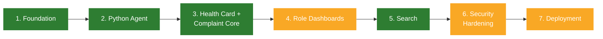

# Roadmap Phases — Planned vs. Actual

`backend/Readme.md` lays out a 7-phase roadmap. This page cross-checks each phase against
the actual code and git history (`git log --oneline`), last verified 2026-08-24.

Green = done, amber = partial, grey = not started as of this snapshot.

## Phase 1: Foundation

**Planned:** MVC skeleton, all 5 Mongoose models, JWT auth, role and department scoping
middleware.

**Actual: done.**

- MVC skeleton exists: `src/routes` → `src/controllers` → `src/services` → `src/models`.
- All 5 models exist and are wired up: `Dept`, `Lab`, `User`, `Pc`, `Complaint` (see
  [`models.md`](./models.md)).
- JWT auth exists: `src/middlewares/auth.middleware.js` verifies a Bearer token and
  populates `req.user`; `src/utils/tokenGeneration.js` issues access/refresh tokens on
  login.
- Role and department scoping middleware exist: `src/middlewares/roleCheck.middleware.js`
  and `src/middlewares/deptScope.middleware.js` (see [`middlewares.md`](./middlewares.md)).

## Phase 2: Python Agent

**Planned:** Hardware/software collector, sync endpoint integration.

**Actual: done**, ahead of what `backend/Readme.md`'s "Repository Status" section
(written earlier) suggests — that section still says the agent hasn't started, but
`agent/collector.py` exists and is functional. See [`agent.md`](./agent.md). It collects
CPU, RAM, disk, OS, and installed software (via the Windows registry) and POSTs to
`/api/v1/pc/sync`.

## Phase 3: Health Card + Complaint Core

**Planned:** Health card view, public complaint flow and token system, escalation state
machine.

**Actual: done.**

- Health card view: `GET-like` `POST /api/v1/pc/:id/health-card` (see note on HTTP verb
  in [`known-issues.md`](./known-issues.md)) returns a department-scoped PC document via
  `getPcHealthCard` in `pc.service.js`.
- Public complaint flow: `POST /api/v1/complaint/` (no auth) creates a complaint with an
  `nanoid(8)` token via `createComplaint` in `complaint.service.js`.
- Escalation state machine: `escalateComplaint` and `resolveComplaint` in
  `complaint.service.js`, driven by the `NEXT_LEVEL` / `STATUS_FOR_LEVEL` lookup tables in
  `constants.js`. See [`complaint-module.md`](./complaint-module.md).
- Public tracking: `GET /api/v1/complaint/track/:token` via `trackComplaint`.
- Role/level-scoped listing: `GET /api/v1/complaint` via `getComplaints`, gated by
  `auth` (scoping itself is computed inside the service via `buildComplaintScope`, not
  `deptScope` middleware).

Everything planned for this phase is now built.

## Phase 4: Role Dashboards

**Planned:** Lab Incharge, HOD, and Dean Infra dashboards with backend-enforced
visibility.

**Actual: mostly done.**

- Backend: `GET /api/v1/complaint` (role- and escalation-level-scoped list, via
  `buildComplaintScope` in `complaint.service.js`) and `GET /api/v1/pc/search` both
  exist and back real dashboard views. No dedicated aggregation/summary endpoints yet —
  the frontend derives its own stats from the raw list. `getComplaints`/
  `escalateComplaint`/`resolveComplaint` now populate `department` (previously only
  `lab`), needed for Dean Infra's cross-department dashboard view.
- Frontend: `LabInchargeHome.jsx`, `HodHome.jsx`, and `DeanInfraHome.jsx` are all built
  (thin wrappers around a shared `ComplaintsDashboard.jsx`, wired to the real
  complaint-list endpoint). `LaboratoriesPage.jsx` (PC search + health-card modal) is
  also built. `ComplaintsDashboard` now derives `canEscalate` separately from `canAct`
  (`effectiveRole !== ROLES.DEAN_INFRA`), so Dean Infra only ever sees Resolve, and shows
  a Department column that Lab Incharge/HOD views omit (they're already
  department-scoped). `EquipmentPage.jsx`/`InventoryPage.jsx`/`RequestsPage.jsx` are
  still stubs (out of scope for the complaint/PC dashboards this phase covers).

## Phase 5: Search (Done)

**Planned:** PC search by configuration and software, indexed queries.

**Actual: done.** `GET /api/v1/pc/search` (`pc.route.js` -> `searchPcs` in
`pc.service.js`) supports regex-escaped, case-insensitive partial matching on
`deadStockNo`/`cpu`/`ram`/`disk`/`os`/`software`, plus exact matches on `warrantyStatus`
and `lab`; auth + `roleCheck(labIncharge, hod, deanInfra)` + `deptScope`-gated. `Pc` has
explicit indexes on `{ department: 1, lab: 1 }` and `{ "warranty.status": 1 }` in
addition to the implicit unique index on `deadStockNo`. Wired up on the frontend via
`PcSearchPage.jsx`/`pcService.js`/`PcHealthCardModal.jsx`.

## Phase 6: Security Hardening

**Planned:** Rate limiting, validation, audit logs, CORS and Helmet.

**Actual: mostly done, one residual gap tracked separately.**

- Helmet: applied (`app.use(helmet())` in `app.js`).
- CORS: applied, configurable via `CORS_ORIGIN` env var.
- Audit logs: the `Complaint.history[]` array is a domain-level audit trail of
  create/escalate/resolve actions — arguably satisfies this for complaints.
- Validation: Zod schemas (`src/validators/`) plus a generic `validate(schema, target)`
  middleware cover login/verify-email/resend-otp/pc-sync/health-card-params/complaint
  create+escalate+resolve. `POST /register` is the one route deliberately left
  unvalidated, tied to its still-open access-control gap — see
  [`known-issues.md`](./known-issues.md).
- Rate limiting: `express-rate-limit` (`src/middlewares/rateLimiter.js`) throttles
  `POST /login`, `POST /verify-email`, `POST /resend-otp`, `POST /complaint`, and
  `POST /pc/sync`; disabled under `NODE_ENV=test`.
- Still open (see [`known-issues.md`](./known-issues.md)): `POST /register` access
  control, `POST /pc/sync` device authentication, access-token revocation on logout.

## Phase 7: Deployment

**Planned:** Dockerization, CI/CD, MongoDB Atlas, agent packaging, load testing.

**Actual: partially started.** A GitHub Actions workflow
(`.github/workflows/ci.yml`) now runs on push/PR to `main`: a `backend` job (Mongo
service container, `npm test`) and a `frontend` job (`npm run lint` + `npm run build`).
Still missing: Dockerfile(s), deployment automation, agent packaging (still run as a
plain Python script via `python agent/collector.py`), and load testing.

## Summary table

| Phase                           | Status                                                                                                                                                                            |
| ------------------------------- | --------------------------------------------------------------------------------------------------------------------------------------------------------------------------------- |
| 1. Foundation                   | Done                                                                                                                                                                              |
| 2. Python Agent                 | Done                                                                                                                                                                              |
| 3. Health Card + Complaint Core | Done                                                                                                                                                                              |
| 4. Role Dashboards              | Mostly done (Lab Incharge/HOD/Dean Infra complaint dashboards and PC search/health-card done; Equipment/Inventory/Requests pages and backend aggregation endpoints still missing) |
| 5. Search                       | Done                                                                                                                                                                              |
| 6. Security Hardening           | Partial (Helmet/CORS/audit trail/rate limiting/request validation done; `/register` access control, `/pc/sync` device auth, and access-token revocation still open)               |
| 7. Deployment                   | Partially started (CI via GitHub Actions; no Docker, no agent packaging, no load testing)                                                                                         |
