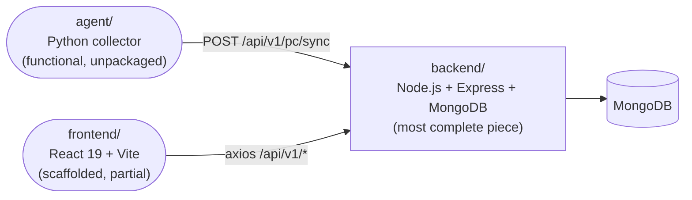
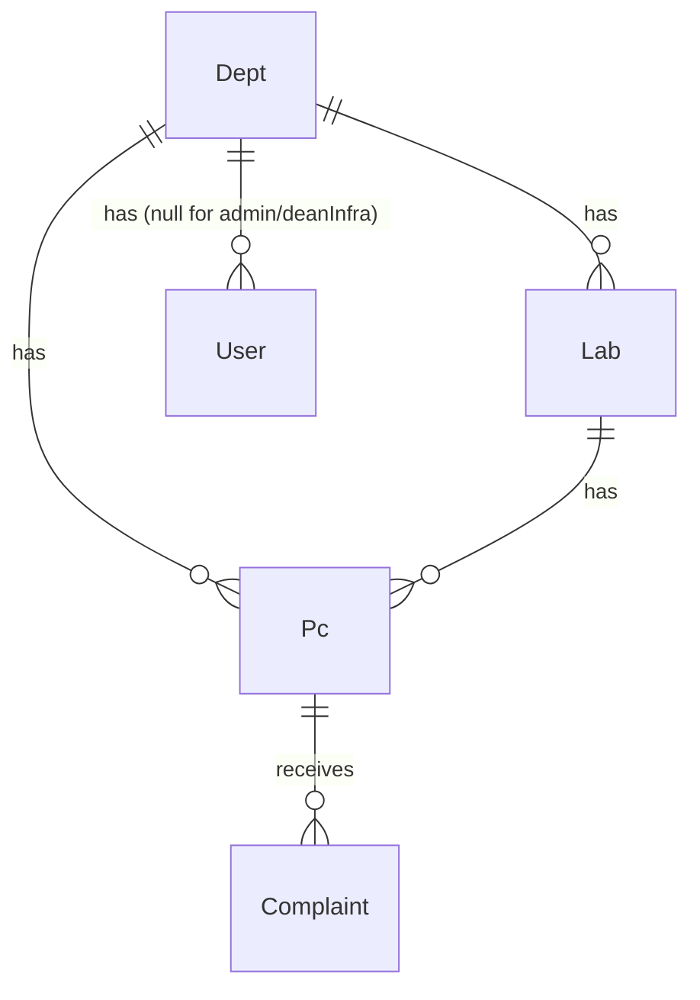
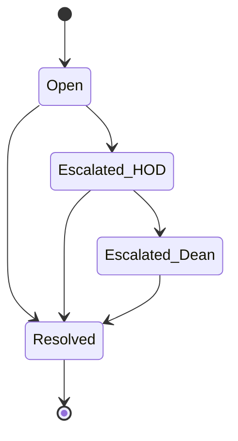

# LABMON — Current System State

_Snapshot written 2026-08-20, refreshed 2026-08-24 by reading the actual code again — the
2026-08-20 version of this doc had itself already drifted from the code on a few points
(see "Docs vs. reality" below for what changed)._

## 1. What LABMON is

A MERN-based lab PC health monitoring and complaint management system for college environments.

- A Python agent runs on each lab PC, collects hardware/software config, and syncs it to the backend, keeping a "digital health card" (department, lab, dead-stock number, warranty) up to date.
- Anyone (no login) can file a complaint about a lab PC, tracked by a unique token.
- Complaints escalate through a fixed chain: **Lab Incharge → HOD → Dean Infra**.
- Access is role- and department-scoped: `labIncharge`/`hod` only see their own department; `admin`/`deanInfra` see everything.

## 2. Repo layout



```
D:\labmon\
├── backend/     Node.js + Express + MongoDB (Mongoose) — most complete piece
├── frontend/    React 19 + Vite — scaffolded, partially built
├── agent/       Python collector (single script) — functional, unpackaged
└── CLAUDE.md    Project instructions for Claude Code (see §6 for doc-freshness notes)
```

Three independent runtimes, no shared package/workspace — each is run and installed separately.

## 3. Backend (`backend/`) — most mature part of the system

Node/Express, ESM (`"type": "module"`), MongoDB via Mongoose. Layering: **routes → controllers → services → models**, controllers wrapped in `asyncHandler`, errors thrown as `ApiError` and caught by a single global `errorHandler`, success responses wrapped in `ApiResponse`.

Run from `backend/`: `npm run dev` (nodemon) or `npm start`. No test runner script wired to CI, but `npm test` runs Node's built-in test runner (`node --test src/tests/**/*.test.js`) against 5 test files (auth, complaint, healthcard, pc, pc.search).

### Domain model


Roles: `admin`, `labIncharge`, `hod`, `deanInfra` (`src/config/constants.js`).



Complaint `status`: `Open → Escalated_HOD → Escalated_Dean → Resolved`; `currentLevel` mirrors the escalation chain and excludes `admin`.

### API surface that actually exists today

**Auth** (`/api/v1/auth`, all public except `logout`/`me`) — registration is OTP-gated,
login is a plain password check that issues tokens directly:
- `POST /register`, `POST /verify-email`, `POST /resend-otp`
- `POST /login` (password check → issues JWT access+refresh tokens as httpOnly cookies
  immediately; the login-OTP step this doc previously described has been removed)
- `POST /refresh-token` (rotates both tokens), `POST /logout` (auth-protected), `GET /me`
  (auth-protected, session rehydration)

**PC** (`/api/v1/pc`):
- `POST /sync` — agent-facing, no auth yet, `$set`s a PC's `config` field-by-field by
  `deadStockNo` (partial payloads no longer wipe the rest); if the dead stock number is
  new and `department`+`lab` are supplied, provisions a brand-new PC instead of 404ing
- `GET /lookup/:deadStockNo` — public, confirms a dead stock number is real and returns
  its department/lab, used by the unauthenticated raise-complaint form
- `POST /:id/health-card` — auth + deptScope, validates `pcId` as a Mongo ObjectId first
  (clean `400` on a malformed id), returns full PC doc (note: implemented as POST though
  it's a pure read)
- `GET /search` — auth + roleCheck(labIncharge/hod/deanInfra) + deptScope; filter by deadStockNo/cpu/ram/disk/os/software (regex, case-insensitive, escaped) and warrantyStatus/lab (exact)

**Complaint** (`/api/v1/complaint`):
- `POST /` — public, creates complaint from `deadStockNo` + description + raisedBy, issues an 8-char `nanoid` token
- `GET /track/:token` — public, returns a trimmed status/level projection
- `GET /` — auth required; role- and escalation-level-scoped list computed inside the
  service (`buildComplaintScope`, not `deptScope` middleware) — hod/deanInfra only see
  complaints currently at their own level, not their whole department/system history; no
  pagination/filtering yet
- `PATCH /:id/escalate` — auth + roleCheck(labIncharge, hod); only the role matching the complaint's current level can move it forward
- `PATCH /:id/resolve` — auth + roleCheck(labIncharge, hod, deanInfra); any level can close it

**Dept** (`/api/v1/dept`):
- `GET /` — public, lightweight `{name, code}` list (used by the frontend's registration/department dropdown)

### What's implemented vs. what's still missing (verified against code, 2026-08-20)

| Area | Status |
|---|---|
| Foundation (models, JWT auth, role/dept middleware) | Done |
| Python agent | Done (functional, not packaged) |
| Health card + complaint core (raise/track/escalate/resolve/list) | Done |
| PC search | Done |
| Auth refresh/logout/resend-OTP | Done (these were "missing" in older docs — now implemented) |
| Department listing | Done (minimal — no admin CRUD yet) |
| Role dashboards | Done — Lab Incharge/HOD/Dean Infra complaint dashboards and PC search built on the frontend against real endpoints; no backend aggregation/summary endpoints yet (frontend derives its own stats from the raw list) |
| Admin CRUD for Dept/Lab/User/Pc | Not started |
| Rate limiting | Not started |
| Request-body validation library (Zod/Joi) | Not started — relies on Mongoose schema validation only |
| Docker/CI/deployment | Not started |
| Agent device authentication | Not started — `/pc/sync` has no credential check |

### Known real issues in the current backend code
- `POST /register` has no access control — anyone can self-register as `admin`. The roadmap says registration should be admin-only.
- `POST /pc/sync` has no device authentication — anyone who knows/guesses a `deadStockNo` can overwrite that PC's config, or provision a new one outright if they also supply a valid `department`/`lab`.
- `POST /resend-otp` doesn't verify the caller owns the email — only `{ email, purpose }` is required, no proof of account ownership.
- Department/level scoping logic exists in *three* different forms: `deptScope` middleware (PC health-card route only), an inline `assertDeptAccess` check in `complaint.service.js`'s escalate/resolve, and `buildComplaintScope` in `complaint.service.js`'s `getComplaints` (department **and** escalation-level aware) — behaviorally consistent today, but not unified.
- No rate limiting anywhere, including on the public `POST /complaint`, `POST /pc/sync`, `POST /login`, and `POST /resend-otp`.

Previously-listed issues that are now fixed: `pc.route.js`'s wrong `Router` import,
`app.js`'s missing leading `/` on the complaint mount, `getPcHealthCard`'s missing
`pcId` validation, `syncPcConfig`'s whole-subdocument overwrite, and hardcoded auth
cookie `maxAge` — see [`backend/docs/known-issues.md`](./backend/docs/known-issues.md)
for the full "already fixed" list.

## 4. Frontend (`frontend/`) — React 19 + Vite, partially built

Run from `frontend/`: `npm run dev` (Vite dev server), `npm run build`, `npm run lint` (oxlint). Talks to the backend via `axios` (`src/services/apiClient.js`, base URL `VITE_API_BASE_URL` or `http://localhost:8000/api/v1`, `withCredentials: true` for the auth cookies, plus a `localStorage` access-token fallback for the `Authorization` header).

### What's actually built
- **Auth flow** (`features/auth/AuthPage.jsx`; `OtpVerification.jsx`) — login/register forms + OTP verification screen (registration only — there is no login-OTP step to verify), wired to `authService.js` (login, register, logout, refresh, verify-email, resendOtp — no stale `verify-login-otp` call anywhere in the frontend).
- **Lab Incharge, HOD, and Dean Infra dashboards** (`features/lab-incharge/LabInchargeHome.jsx`, `features/hod/HodHome.jsx`, `features/dean-infra/DeanInfraHome.jsx`) — all thin wrappers around a shared `features/complaints/ComplaintsDashboard.jsx`: complaint list/stats, a `Donut.jsx` chart, `ComplaintDetailModal.jsx`/`ResolveComplaintModal.jsx`. Wired to the real `GET /api/v1/complaint` endpoint — no mock data file in the current tree. `ComplaintsDashboard` derives `canEscalate` separately from `canAct` (false when `effectiveRole === ROLES.DEAN_INFRA`), so Dean Infra only ever sees Resolve, matching the backend having no level above it. Dean Infra's view also shows a Department column, since it's the only role that isn't department-scoped — this required the backend to populate `complaint.department` in `complaint.service.js` (previously only `lab` was populated).
- **Laboratories / PC search** (`features/laboratories/LaboratoriesPage.jsx`, wrapping `PcSearchPage.jsx` + `PcHealthCardModal.jsx`, backed by `pcService.js`) — also real and wired to the real search/lookup endpoints.
- **Routing** (`app/routes.jsx`) — role-gated routes via `ProtectedRoute.jsx` + `ROLES`/`ROUTES` constants that mirror the backend's role/status enums by hand (`frontend/src/constants/roles.js` has a comment noting it must be kept in sync manually — there's no shared package between frontend/backend).
- **Auth context** (`app/providers/AuthProvider.jsx`) — minimal: just a `user`/`setUser` React context, no token-refresh-on-expiry logic yet.

### What's a stub
`EquipmentPage.jsx`, `InventoryPage.jsx`, `RequestsPage.jsx` are still placeholder components — routed to, but with no real content yet. `src/store/` remains empty (`.gitkeep` only) — no state-management library adopted yet.

A `frontend/dist/` build output is checked into the tree from a prior `vite build` run.

## 5. Python agent (`agent/collector.py`)

A single-file, manually-run CLI script (`python agent/collector.py`) — **not** a background service or scheduled task.

- Prompts for a dead-stock number on stdin, then for a Department name and Lab name
  (both optional — only needed the first time a PC is provisioned; left blank on
  subsequent syncs to leave the existing department/lab untouched).
- Collects CPU (marketing name from the Windows registry's `ProcessorNameString` where
  available, falling back to `platform.processor()` + `cpu_freq()` otherwise), RAM,
  disk, OS via `psutil`/`platform` (cross-platform), plus installed software via a
  Windows registry scan (`winreg`, Windows-only — silently returns `[]` on non-Windows).
- POSTs `{ deadStockNo, department?, lab?, config }` to
  `{LABMON_BACKEND_URL}/api/v1/pc/sync` (default `http://localhost:8000`, which does
  **not** match the backend's own sample `.env` default of port 5000 — set
  `LABMON_BACKEND_URL` explicitly when running the agent locally).
- No authentication on the request (matches the backend's currently-open `/pc/sync` endpoint).
- Dependencies: `psutil`, `requests` (`agent/requirements.txt`); a `venv/` is present locally but gitignored.

## 6. Docs vs. reality — status as of 2026-08-24

As of the 2026-08-20 snapshot, `CLAUDE.md`, `backend/docs/*.md`, and `backend/Readme.md`
had all drifted from the code in different ways and at different times (frontend/agent
work not reflected, login-OTP removal not reflected, several "known" bugs already fixed
without the docs catching up). That drift has now been swept in a documentation-refresh
pass:

- `CLAUDE.md` — updated: "Known gaps," the auth-flow description, the escalation/scoping
  description, and the frontend-status bullets all now match the code.
- `backend/docs/*.md` — updated across the board (`agent.md`, `pc-module.md`,
  `auth-module.md`, `complaint-module.md`, `middlewares.md`, `utils.md`, `models.md`,
  `constants.md`, `architecture.md`, `known-issues.md`, `phases.md`) to cover the `dept`
  module, the department/lab PC-provisioning flow, the login-OTP removal, the
  field-by-field `syncPcConfig` merge, and the three-way department/level scoping split.
- `frontend/docs/frontend-design.md` — updated to reflect that the Lab Incharge and HOD
  dashboards, and PC search, are real and wired to live endpoints (not mock data), and
  that only Dean Infra/Equipment/Inventory/Requests remain stubs.
- `backend/Readme.md` — "Repository Status" and "Planned API Surface" sections updated to
  match the actual current route list (previously still framed the agent/frontend as
  future work and used a stale `/api/*` prefix instead of `/api/v1/*`).

This document (`currentSystem.md`) is itself a hand-maintained snapshot, not generated
from the code — treat *it* as due for the same kind of re-verification the next time a
significant round of backend/frontend changes lands, rather than assuming it stays
accurate indefinitely.

## 7. Suggested next steps (from the roadmap gaps in §3/§4)

1. Add device-key auth to `POST /pc/sync` and role-restriction to `POST /register`, the
   two flagged open security gaps.
2. Decide on Admin CRUD (Dept/Lab/User/Pc) — currently no create/update/delete endpoints
   exist for any of these, only reads.
3. Build out `EquipmentPage`/`InventoryPage`/`RequestsPage`, still stub placeholders.

Done since the last pass: `ComplaintsDashboard` now derives `canEscalate` separately from
`canAct` (`effectiveRole !== ROLES.DEAN_INFRA`), so `DeanInfraHome` correctly offers only
Resolve; a Department column (backed by a new `complaint.department` populate in
`complaint.service.js`) was added for Dean Infra's cross-department view. See
[`frontend/docs/frontend-design.md`](./frontend/docs/frontend-design.md) Phase 3.
