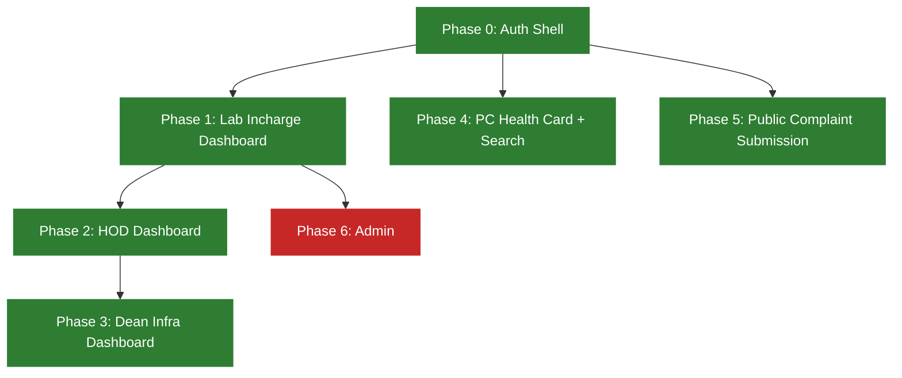

# Frontend Design — Phase Plan

What the frontend needs to build, phase by phase, driven strictly by what the backend
already exposes (`backend/src/routes/*`). Each phase only uses endpoints that exist
today — nothing here assumes an unbuilt backend feature. Status reflects the codebase as
of 2026-08-21.

Reference for the "already built" look-and-feel: `features/complaints/ComplaintsDashboard.jsx`
(the shared component `LabInchargeHome.jsx`/`HodHome.jsx` both wrap) + `Donut.jsx` +
`ComplaintDetailModal.jsx` + `ComplaintsDashboard.css`. Further screens (`PcSearchPage.jsx`
already does this) should reuse this pattern (stat cards with donut charts, panel + table,
detail modal reusing `AuthPage.css` classes) rather than inventing a new visual language.

## Phase status at a glance

Green = done, grey = not started, red = blocked on backend work.

## Phase 0: Auth Shell — Done

Backend: `POST /auth/register`, `verify-email`, `resend-otp`, `login`, `refresh-token`,
`logout`, `GET /auth/me`. Login is a single-step password check that issues JWT cookies
directly — there is no `verify-login-otp` route on the backend (it was removed; only
registration still has an OTP-verification step), and the frontend's `authService.js`
correctly never calls one.

- `AuthPage.jsx` — login/signup tabs, OTP step, role + department selects.
- `OtpVerification.jsx` — OTP entry, resend.
- `AuthProvider.jsx` — calls `GET /auth/me` on mount to rehydrate `user` from the
  still-valid session cookie after a hard refresh (`useAuth.js` hook exposes
  `user`/`setUser`/`loading` from the context).
- `ProtectedRoute.jsx` — role-gated routing via `ROLES`/`ROUTES` constants; redirects to
  `ROUTES.LOGIN` while `loading` is true or the role isn't in `allowedRoles`.
- `apiClient.js` — axios response interceptor: on a 401 (that isn't itself a
  refresh-token call, and hasn't already been retried) it calls
  `POST /auth/refresh-token` once (de-duped via a shared `refreshPromise` so concurrent
  401s only trigger one refresh) and retries the original request.

Closed: the refresh-on-expiry gap called out in the previous version of this doc is done.

## Phase 1: Lab Incharge Dashboard — Done

Backend: `GET /complaint` (auth, role/level-scoped server-side via
`buildComplaintScope` — see [`complaint-module.md`](../../backend/docs/complaint-module.md)),
`PATCH /complaint/:id/escalate`, `PATCH /complaint/:id/resolve`.

Built as a **shared, role-parameterized component**, not a Lab-Incharge-only one:
`features/complaints/ComplaintsDashboard.jsx` (+ `Donut.jsx`, `ComplaintDetailModal.jsx`,
`ResolveComplaintModal.jsx`, `complaintMeta.js` for status label/color + date formatting,
`ComplaintsDashboard.css`) — header with user name/department badge/logout, 4 stat cards
(total/open/escalated/resolved, each also a clickable status filter) with donut charts,
a searchable complaints table, detail modal with Escalate/Resolve actions and history.
`features/lab-incharge/LabInchargeHome.jsx` is now a ~5-line wrapper:
`<ComplaintsDashboard role={ROLES.LAB_INCHARGE} subtitle="LAB INCHARGE" defaultName="Lab Incharge" />`.

- `complaintService.js` wraps `GET/PATCH /complaint` via `apiClient`;
  `ComplaintsDashboard` fetches `listComplaints()` on mount (real backend data — no mock
  data file is used) and replaces the affected complaint in local state from each
  escalate/resolve response rather than refetching the whole list.
- `canAct(complaint)` gates the row/modal actions on
  `complaint.currentLevel === (user?.role || role)` (plus not already `Resolved`) —
  matches the backend's role-gated escalate check instead of always offering an action
  that could 403.
- Resolve goes through `ResolveComplaintModal` (captures remarks) before calling
  `PATCH /complaint/:id/resolve`; escalate is a direct one-click action.
- Loading and error states are wired for both the initial fetch and the
  escalate/resolve actions (`loadError`/`actionError`/`resolveError`).
- A toolbar link to `ROUTES.LABORATORIES` (PC search, Phase 4) is present in the shared
  dashboard header.

## Phase 2: HOD Dashboard — Done

Backend: same `GET /complaint` — for an HOD, `buildComplaintScope` returns
`{ department: user.department, currentLevel: ROLES.HOD }`, so the list is already
narrowed server-side to their department's complaints currently sitting at HOD (no
client-side filtering needed); `PATCH /complaint/:id/escalate` (role-gated to whichever
role owns the complaint's *current* level — HOD can escalate to Dean Infra),
`PATCH /complaint/:id/resolve`.

`features/hod/HodHome.jsx` is the same pattern as Lab Incharge — a thin wrapper over the
shared `ComplaintsDashboard`: `<ComplaintsDashboard role={ROLES.HOD} subtitle="HOD"
defaultName="HOD" />`. No separate HOD-specific component was built; the "extract into a
shared component" plan from the previous version of this doc is what actually shipped,
so Phase 3 (Dean Infra) is now just wiring the same component with a different role.

## Phase 3: Dean Infra Dashboard — Done

Backend: `GET /complaint` (for `deanInfra`, `buildComplaintScope` returns
`{ currentLevel: ROLES.DEAN_INFRA }` — no department filter, since Dean Infra is
cross-department, but still narrowed to complaints currently at their level),
`PATCH /complaint/:id/resolve` only — Dean Infra is the last level, there is no further
escalate target (`NEXT_LEVEL` has no entry past `deanInfra`).

`features/dean-infra/DeanInfraHome.jsx` is the same thin-wrapper pattern as Lab
Incharge/HOD: `<ComplaintsDashboard role={ROLES.DEAN_INFRA} subtitle="DEAN INFRA"
defaultName="Dean Infra" />`.

- `ComplaintsDashboard.jsx` now derives `canEscalate(complaint)` separately from
  `canAct(complaint)` (`canAct(complaint) && effectiveRole !== ROLES.DEAN_INFRA`), so the
  Escalate button/action is hidden for Dean Infra in both the table row and
  `ComplaintDetailModal` (which now takes separate `canEscalate`/`canResolve` props
  instead of one combined `canAct`) — Dean Infra only ever sees Resolve.
- A Department column is now shown in the table (and in the detail modal's meta grid)
  when `effectiveRole === ROLES.DEAN_INFRA`, since their list spans departments; Lab
  Incharge/HOD views don't render it, since they're already single-department scoped.
- Backend: `complaint.service.js`'s `getComplaints`/`escalateComplaint`/`resolveComplaint`
  now `.populate("department", "name")` (previously only `lab` and `history.by` were
  populated, so `complaint.department` was a raw ObjectId) so the frontend can render the
  department name.

## Phase 4: PC Health Card + Search — Done

Backend: `GET /pc/search` (auth + roleCheck(labIncharge/hod/deanInfra) + deptScope),
`POST /pc/:id/health-card` (yes, `POST` not `GET` — a known backend sharp edge, not a
frontend choice), `GET /pc/lookup/:deadStockNo` (public).

Built: `features/pc-search/PcSearchPage.jsx` + `PcHealthCardModal.jsx` +
`pcSearchMeta.js` (warranty-status label/color) + `PcSearchPage.css`, backed by
`services/pcService.js` (`searchPcs`, `lookupPc`, `getPcHealthCard`).
`features/laboratories/LaboratoriesPage.jsx` is now a one-line wrapper —
`<PcSearchPage />` — so the "Laboratories" nav entry *is* the PC search screen (there is
no separate lab-vs-equipment split; the backend only has one `Pc` model with
`Dept`/`Lab` refs, matching the note this doc previously flagged as an open question).

- The search form covers all of `searchPcs`'s query params (`deadStockNo`, `cpu`, `ram`,
  `disk`, `os`, `software`, `warrantyStatus`), reusing the dashboard's panel/table CSS
  classes. Results load on mount with no filters (full department-scoped list) and
  re-run on submit/reset.
- Clicking a result row opens `PcHealthCardModal`, which renders `deadStockNo`,
  `department`, `lab`, `warranty.status`/`expiryDate`, and the full `config`
  (cpu/ram/disk/os/software/lastSyncedAt) — but **from the search-result object already
  in hand**, not via a fresh `POST /pc/:id/health-card` call. `getPcHealthCard` exists in
  `pcService.js` but nothing currently calls it, since `searchPcs` already returns every
  field the modal needs; it's unused code today, not a broken integration.
- `EquipmentPage.jsx`/`InventoryPage.jsx`/`RequestsPage.jsx` remain unbuilt placeholder
  stubs — `RequestsPage`/`InventoryPage` don't correspond to anything the backend exposes
  yet, and `EquipmentPage` is redundant with what `LaboratoriesPage`/`PcSearchPage` now
  covers if "Equipment" was meant to be PC-per-department.

## Phase 5: Public Complaint Submission + Tracking — Done

Backend: `POST /complaint` (public, no auth), `GET /complaint/track/:token` (public).

Built: `RaiseComplaintPage.jsx`, `TrackComplaintPage.jsx`, `PublicComplaint.css` — both
mounted outside `ProtectedRoute` at `/`, `ROUTES.RAISE_COMPLAINT` and
`ROUTES.TRACK_COMPLAINT` respectively, reusing `AuthPage.css` form classes but with their
own page chrome (no logged-in-user header, since there's no session here).

- `raiseComplaint`/`trackComplaint` in `complaintService.js` wrap the two public
  endpoints.
- Raise form collects `deadStockNo`, `description`, `raisedBy: { name, contact }`; on
  success shows the returned tracking token with a "raise another" reset and links to
  track/staff-login.
- Track page takes a token, calls `GET /complaint/track/:token`, and renders
  status/currentLevel/description/createdAt from the response (`STATUS_LABELS`/
  `LEVEL_LABELS` maps built from the `ROLES`/`COMPLAINT_STATUS` constants rather than
  hardcoded strings).
- `RaiseComplaintPage` also serves as the `/` catch-all landing route and the
  `path="*"` redirect target in `routes.jsx`.

## Phase 6: Admin — Blocked on backend (no admin CRUD exists yet)

Backend today has `admin` as a role in `ROLES` and in the CORS/complaint bypass logic,
but there's no admin CRUD route for Dept/Lab/User/Pc — only `GET /dept` (read-only,
already consumed by Phase 0's signup dropdown). **Do not start building an admin panel
UI until the backend actually exposes create/update/delete endpoints** — there's nothing
to wire it to yet, and speculative admin screens would just be dead code sitting on
`InventoryPage.jsx`/`RequestsPage.jsx`'s current stub placeholders.

## Cross-cutting frontend gaps (apply across every phase above)

- **`complaintService.js` and `pcService.js` both exist** (`services/`, alongside
  `authService.js` and `deptService.js`) — `complaintService.js` covers
  `listComplaints`/`escalateComplaint`/`resolveComplaint`/`raiseComplaint`/
  `trackComplaint`; `pcService.js` covers `searchPcs`/`lookupPc`/`getPcHealthCard`. Reuse
  both for Phase 3 (Dean Infra) rather than duplicating axios calls.
- **`ROLES`/`COMPLAINT_STATUS` are hand-mirrored** from `backend/src/config/constants.js`
  into `frontend/src/constants/roles.js` — if the backend enum changes, this file must be
  updated by hand; there's no shared package. Check this file against the backend's
  `constants.js` whenever a phase surfaces a new status/role value.
- **No state-management library** (`src/store/` is empty) — fine for Phases 1–3 if each
  dashboard just fetches its own `GET /complaint` on mount, but revisit if multiple
  screens end up needing the same complaint list simultaneously (e.g. a shared header
  badge showing open-complaint count).
